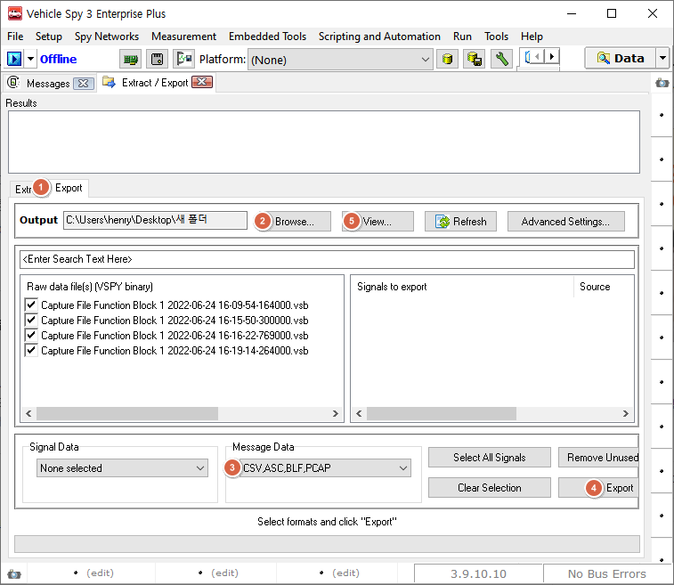

# 메시지 포맷으로 변환

### 들어가며..

이번 장에서는 vsb 로그파일을 다른 메시지포맷 확장자로 변경하는 방법을 알아보겠습니다.

### 하나의 VSB만 변환

Tools > File Conversions 에서 아래와 같이 asc, blf 등의 파일 변환 기능을 제공하고 있습니다.

<figure>

<figcaption>Tools->File Conversions</figcaption>
</figure>

### 여러개의 VSB를 한꺼번에 변환

1. Tools->Extract/Export에서 Export탭으로 이동합니다.
2. Output 경로 옆 Browse...버튼을 눌러 변환할 파일(vsb)이 있는 경로를 선택합니다.
3. 원하는 파일 형식을 Message Data 드롭다운에서 선택합니다.
4. Export 버튼을 누르면 Output 경로에 지정된 형식으로 파일이 저장됩니다.
5. View... 버튼을 눌러 저장 경로를 열 수 있습니다.

<figure>

<figcaption>Tools->Extract/Export->Export 탭</figcaption>
</figure>

