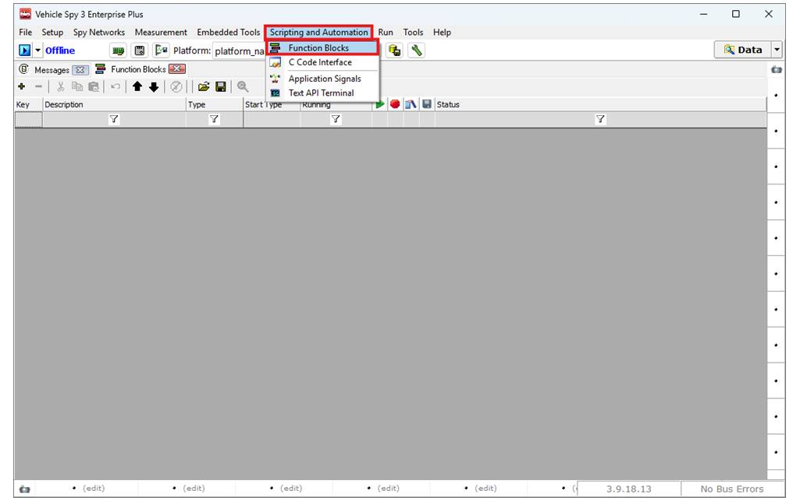
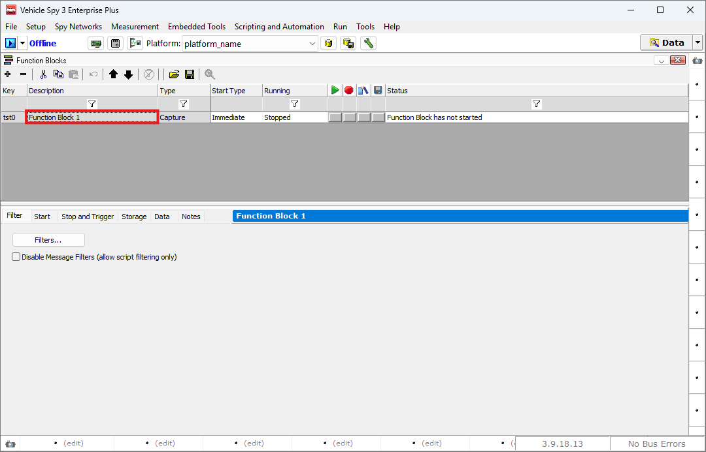

# Capture Function Block을 이용한 메세지 저장법

### 들어가며..

Function Block은 Vehicle Spy 3에서 제공하는 강력한 기능 중 하나로, 자동화 스크립트 작성, 네트워크를 통해 전송되는 데이터 저장, 이전에 수집된 메시지나 사용자가 정의한 메시지를 특정 방식으로 재생(Playback)하는 등 다양한 작업을 수행할 수 있습니다. 스크립트와 플레이백 기능에 대한 자세한 설명은 여기에서 확인하실 수 있습니다.

이번 시간에는 다양한 기능 중 Capture Function Block 기능을 사용하여 네트워크에서 전송되는 메시지를 저장하는 방법을 알아보겠습니다.

### Capture type Function Blocks

Capture type function blocks는 capture block이라고도 불리며 네트워크를 통해 전송되는 데이터를 실시간으로 수집하고 이를 저장할 수 있습니다.

아래 그림과 같이 Scripting and Automation > Function Blocks로 이동합니다.

<figure>

<figcaption>Logging: Function Blocks</figcaption>
</figure>

아래 그림과 같이 + 버튼을 누른 후 Capture 버튼을 눌러 새로운 Capture Block을 생성합니다.

<figure>

<figcaption>Logging: Creating New Capture Block</figcaption>
</figure>

생성된 Capture Block은 다음과 같습니다. \
Description을 더블 클릭하여 Capture Block의 이름을 변경할 수 있습니다.&#x20;

### Filter 탭

Filter 탭에서는 특정 네트워크(eg. DW CAN 01)의 메시지만 저장하거나, 특정 네트워크의 메시지를 제외할 수 있습니다. 아무런 설정을 하지 않으면 모든 네트워크를 통해 전송되는 메시지를 저장합니다.

<figure>

")
<figcaption>Logging: Capture Block(Filter)</figcaption>
</figure>

### Start 탭

Start 탭에서는 로깅 시작 조건을 설정할 수 있습니다.

<figure>

")
<figcaption>Logging: Capture Block(Start)</figcaption>
</figure>

시작 조건에대한 설명은 다음과 같습니다.

* Start Immediately: Online 상태가 되면 바로 로깅을 시작합니다.
* Manual Start: 수동으로 로깅을 시작합니다. 아래의 단축키 또는 화면 중앙의 초록 화살표 아래 버튼을 통해 로깅을 시작할 수 있습니다.
* Use Start Expression:  Expression builder를 통해 정의한 수식이 참이 될 때 로깅을 시작합니다.
* Start Immediately Embedded Only: 이 옵션은 장치 단독 로깅에서 사용하는 옵션입니다. 장치에 해당 스크립트를 심어 장치가 Online 상태가 되면 바로 로깅을 시작합니다.

아래의 Start/Stop Hotkey 옵션을 사용하여 Manual Start 시 사용할 로깅 시작/종료 단축키를 선택하실 수 있습니다.

Timing Precision: 로깅의 시간 정확도를 Microseconds/Milliseconds 중 선택할 수 있습니다. Automatic으로 두면 자동으로 최선의 정확도로 로깅합니다.

When Execution Finishes 옵션에 대한 설명은 다음과 같습니다.

* Stop, do nothing: 로깅이 마무리가 되면 더이상 추가 작업을 하지 않습니다.
* Restart Execution: 즉시다시 로깅을 시작합니다.
* Wait for start conditions again: 로깅 시작 조건이 다시 참이 될 경우 로깅을 다시 시작합니다.

### Stop and Trigger 탭

다음은 로깅의 종료 옵션을 선택할 수 있는 Stop and Trigger 탭입니다.

<figure>

")
<figcaption>Logging: Capture Block(Stop and Trigger)</figcaption>
</figure>

로깅 종료 옵션은 다음과 같습니다.

* Collect in a circular buffer: 종료 버튼을 누르기 이전까지의 내용을 circular buffer(환형 버퍼)에 저장합니다. 메시지가 버퍼의 크기를 넘을 경우 가장 오래된 내용부터 메시지가 삭제됩니다.
* Collect in a one-shot buffer: 로깅 시작 후 설정한 크기까지만 메시지를 저장합니다. 메시지가 버퍼의 크기를 넘을 경우 로깅을 중단합니다.
* Collect before and after a trigger expression: Expression builder를 통해 정의한 수식이 참이 될 때 앞 뒤 일정 크기의 메시지를 로깅합니다. 이 때 일정 크기는 메시지의 수, 메시지가 들어온 시간 중 선택할 수 있습니다.
* Collect before and after a manual trigger: 직접 버튼을 누를 때 앞 뒤 일정 크기의 메시지를 로깅합니다.
* Stop on expression: Expression builder를 통해 정의한 수식이 참이 될 때 로깅을 중단합니다.
* Manual Stop: 직접 정지 단축키를 누르거나 상단의 정지 버튼을 클릭하여 로깅을 중단합니다.

Collect before and after a trigger expression 메뉴의 내용을 자세히 설명하겠습니다.

Pre Trigger 탭은 해당 조건이 만족되기 이전에 얼마큼의 메시지를 저장할 것인지를 설정합니다. Number of Messages를 통해 메시지의 숫자를 기준으로 저장할 수 있고, For a Length of Time (seconds)을 통해 시간으로 설정할 수도 있습니다.&#x20;

Trigger Expression은 Expression Builder를 통해 정의한 수식을 표시합니다.&#x20;

Advanced Trigger Option을 통해 더욱 상세한 설정이 가능합니다.

* Trigger when expression is true () for at least \[] seconds: 해당 체크박스를 선택할 경우 조건을 만족하고 일정 시간이 지나야 로깅이 시작됩니다.
* Trigger when expression changes: 정의한 수식의 내용이 변경되었을 때 로깅을 시작합니다.
* Trigger when expression \[increases/decreases/changes] by \[more than/less than/exactly] \[]\(seconds): 를 통해 값이 특정 양상으로 변할 경우 로깅도 가능합니다.

Trigger Control and Notification Options를 통해 단축키로 Trigger를 동작시키고, 소리를 재생할 수 있습니다.

### Storage 탭

Storage 탭에서는 저장 옵션을 선택할 수 있습니다.

<figure>

")
<figcaption>Logging: Capture Block(Storage)</figcaption>
</figure>

저장 옵션은 다음과 같습니다.

* Manual save: 화면 중앙의 저장 버튼을 눌러 저장합니다.
* Automatically save when complete: 로깅을 끝내면 자동으로 저장합니다.
* Save when expression true: 지정한 수식이 참일 경우에만 저장합니다.
* Stream to disk: 해당 옵션은 위의 저장 옵션을  one-shot buffer, stop expression, manual stop으로 선택한 경우에만 사용이 가능합니다. 이 기능은 네트워크의 메시지를 바로 .vsb 형태로 저장합니다. 다른 옵션의 경우 .temp 파일을 통해 버퍼를 만들어 둔 뒤, 로깅이 끝나면 .temp 파일이 자동으로 .vsb 파일로 변환됩니다.

다음은 저장 될 파일의 이름을 선택하는 기능입니다.

* Storage File: 로그 파일의 이름입니다.&#x20;
* Append Time and Data to file name: 로깅 일시를 파일 이름 뒤에 붙여 파일 중복을 방지합니다. 만일 이 옵션을 선택하지 않아 중복된 파일 이름으로 로깅을 진행한 경우 이전에 로깅되었던 파일이 삭제됩니다.
* Append App Signal to file name: 앱 시그널의 값을 파일 이름 뒤에 붙여 저장합니다.
* ZIP File: 로그 파일을 압축하여 저장합니다. PC 스토리지의 공간을 절약할 수 있습니다.
* Save As Binary File(bus messages only): 해당 옵션을 선택시 자동으로 .vsb 파일만 저장합니다. 이 옵션을 선택하지 않으면 .csv 형식으로 로그 파일이 저장됩니다.&#x20;
* Save Expression: 'Save when expression true' 옵션에서 사용할 수식을 지정할 수 있습니다.
* Hotkey: 저장 버튼의 단축키를 설정합니다.
* Click to set an encryption password: 해당 옵션을 통해 로그 파일에 비밀번호를 설정할 수 있습니다. 비밀번호를 설정하면 .vseb확장자로 파일을 저장합니다.
* Add Notes to File: .csv 형식으로 로그를 저장할 경우, 메시지를 남길 수 있습니다.

### Data 탭

Data 탭을 통해 현재 로깅중인 데이터를 볼 수 있습니다.

<figure>

")
<figcaption>Logging: Capture Block(data)</figcaption>
</figure>

