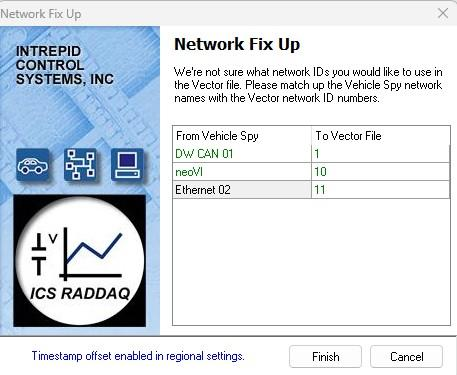

# VSB 파일 추출 및 변환

### 들어가며..

이번엔 장치에 로깅된 .vsb 파일을 추출하고, 추출한 파일의 포맷을 변환하는 방법을 알아보겠습니다.

### Data Exctract

1. Tools > Extract/Export 메뉴로 이동합니다.
2. Source가 올바른 장비 또는 SD 카드로 인식되어있는지 확인합니다. 인식되지 않은 경우 Referesh 버튼을 누릅니다.
3. Output에서 추출된 데이터가 저장될 경로를 선택합니다.
4. Extract All Files를 누르면 SD 카드에 저장된 모든데이터가 VSB 파일로 추출됩니다.
5. 원하는 기간 또는 원하는 파일만 추출하기를 원하는 경우 기간과 파일을 선택한 후 Extract Selected Files(n)를 클릭합니다. (파일 선택은 neoVI FIRE2, Rad Galaxy 등 상위 장비에서만 지원됩니다.)

<figure>

")
<figcaption>Tools > Extract/Export (Extract)</figcaption>
</figure>

### Data Export

Export 탭에서는 추출한 .vsb 파일을 다른 확장자(.csv, .blf, .pcap, .mdf)로 변환할 수 있는 기능을 제공합니다. 우선 아래 그림과 같이 Export 탭을 누릅니다.

<figure>

")
<figcaption>Tools > Extract/Export (Export)</figcaption>
</figure>

Raw data file(s) (VSPY binary) 는 변환할 원본 vsb 파일을 나타냅니다. 해당 탭에서 변환을 원하는 데이터를 모두 선택합니다.

아래 Signal Data / Message Data를 통해 시그널 데이터와 메시지 데이터를 원하는 형식으로 변환하여저장할 수 있습니다. .vsdb 파일을 등록하면 아래 그림과 같이 Signals to export 창이 활성화 됩니다. 변환을 원하는 메시지를 모두 선택 후 우측 하단의 Export 버튼을 누르면 파일을 변환할 수 있습니다.

<figure>

")
<figcaption>Tools > Extract/Export (Export)</figcaption>
</figure>

.vsdb 파일을 등록하면 아래 그림과 같이 Signals to export 창이 활성화 됩니다. 변환을 원하는 메시지를 모두 선택 후 우측 하단의 Export 버튼을 누르면 파일을 변환할 수 있습니다.

<figure>

")
<figcaption>Tools > Extract/Export (Export)</figcaption>
</figure>

변환 시작 시, 포맷에 따라 아래와 같은 Network Fix Up 팝업창이 나타날 수 있습니다. 이는 Vehicle Spy3에서 표현하는 네트워크 (DW CAN01 등의 통신 채널)과 타사 SW에서 표현하는 네트워크의 명칭이 달라 매칭해주기 위함 입니다.

<figure>

<figcaption></figcaption>
</figure>

