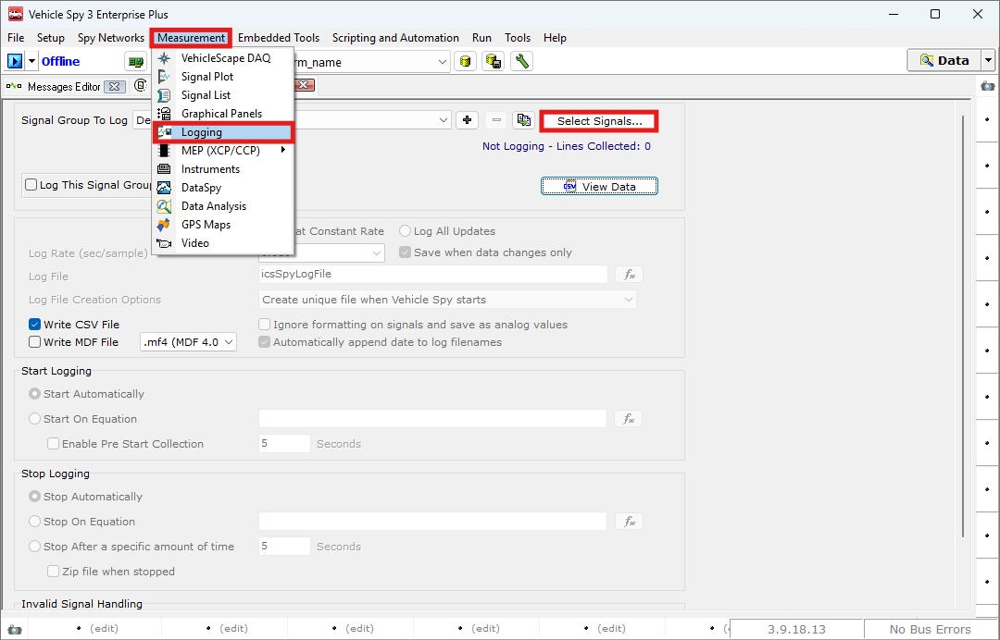
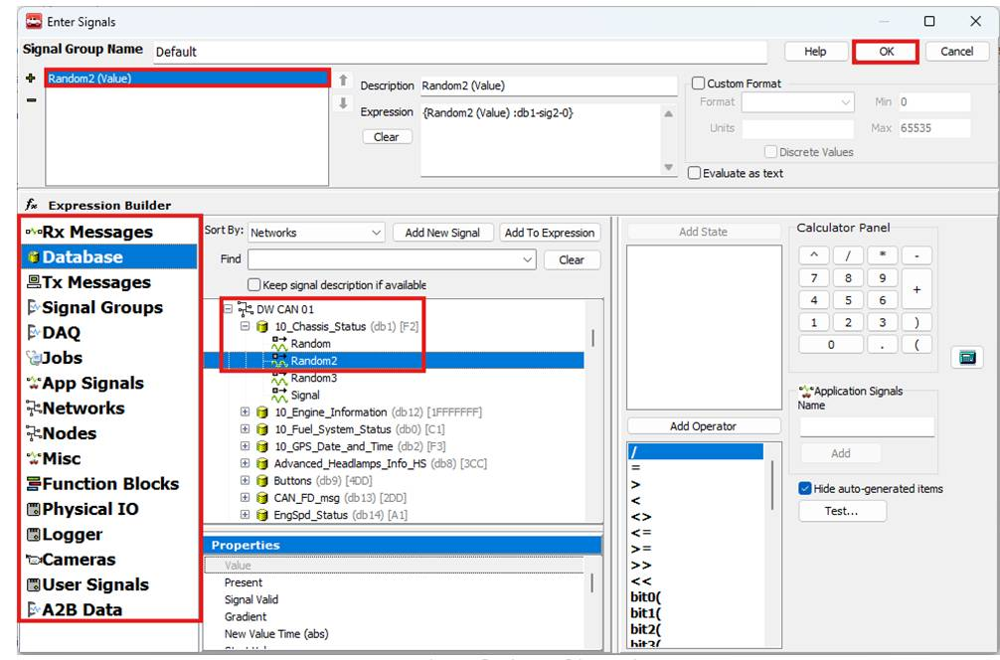
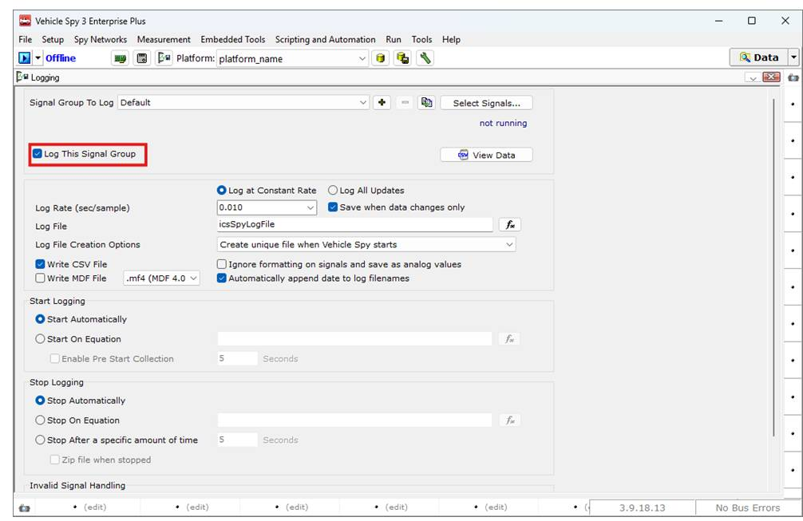
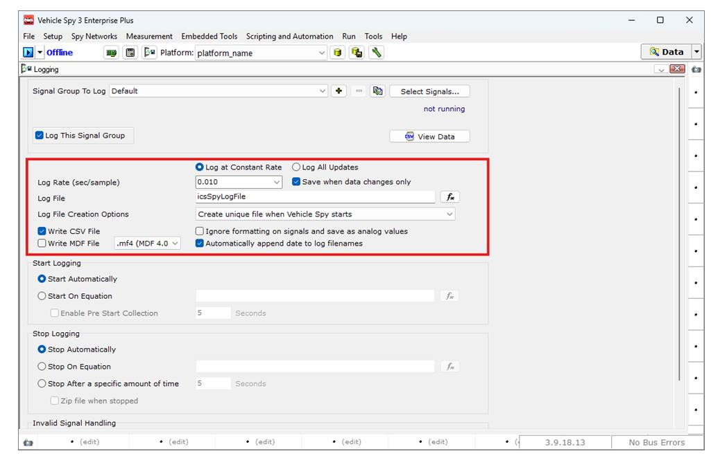
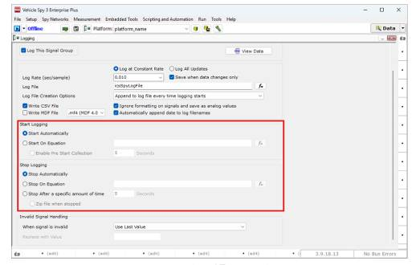
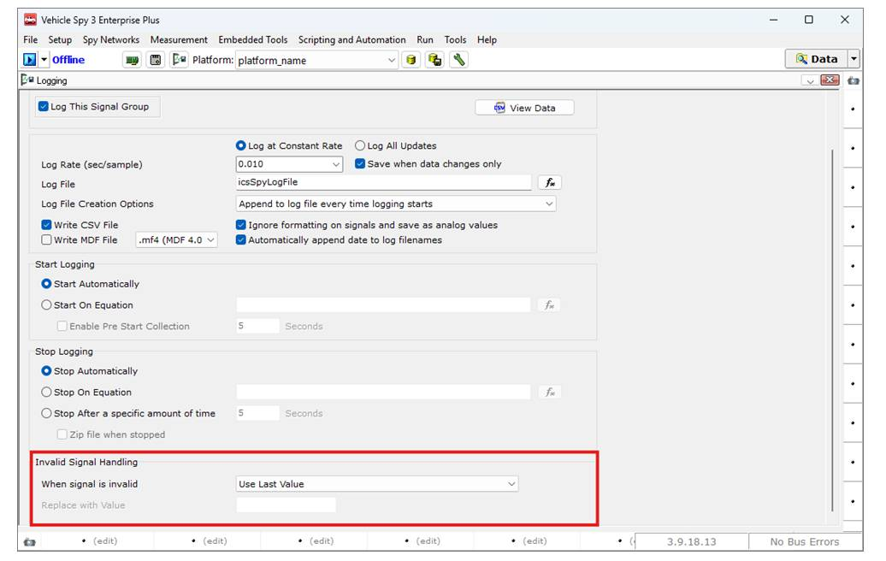
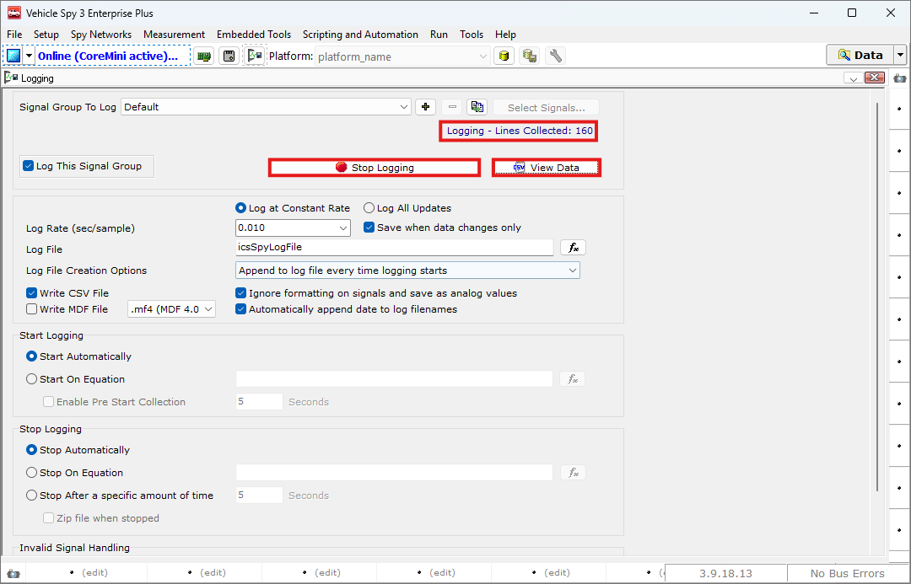

# Logging 메뉴에서 신호 저장법

## 들어가며..

이번 챕터에서는 Measurement 메뉴의 Logging 기능을 통해 시그널 데이터를 저장하는 방법에 대해 알아보겠습니다.

### Logging

아래 그림과 같이 Measurement > Logging으로 이동합니다.

<figure>

<figcaption>Measurement > Logging</figcaption>
</figure>

Offline 상태에서 로깅을 원하는 신호를 선택하기 위해 Select Signals... 버튼을 클릭합니다.

아래와 같이 좌측에서 위치를선택후 로깅을 원하는 신호를 더블클릭하여 상단 리스트에 추가합니다. 

<figure>

<figcaption>Logging: Select Signals</figcaption>
</figure>

좌측 상단의 시그널순서대로 로그 파일에 저장됩니다.

Expression Builder를 통해 로깅 시 더욱 복잡한 조건을 설정하실 수 있습니다.

로깅을 원하는 신호를 모두 선택하셨다면 OK 버튼을 눌러 원래 화면으로 돌아갑니다.

아래 그림과 같이 Log This Signal Group을 체크하면 선택한 신호 그룹의 로깅이 활성화되며, 이후 데이터를 저장할 수 있습니다.

<figure>

<figcaption>Logging: Log Signal Group</figcaption>
</figure>

## 저장 옵션 설정

두 번째 문단을 통해 저장 옵션을 선택할 수 있습니다.

<figure>

<figcaption>Logging: Storage Option Settings</figcaption>
</figure>

Log at Constant Rate: 아래의 Log Rate(sec/sample)의 주기로 메시지를 저장합니다.

Log All Updates: 들어오는 모든 신호를 저장합니다.

Log Rate (sec/sample): 로깅 주기를 설정합니다. 단위는 초 입니다.

Log File: 저장될 파일의 이름입니다. Expression Builder를 활용해 더욱 상세하게 설정할 수 있습니다.

Log File Creation Options: 같은 이름의 로그 파일이 저장될 때, 새로운 파일을 생성하는 방식을 설정할 수 있습니다. 선택 가능한 옵션은 다음과 같습니다.

- Create unique file when Vehicle Spy starts: 이 옵션은 로그 파일의 이름을 Online 상태가 될 때의 시간을 사용하여 구분합니다. 따라서 로깅이 진행된 횟수만큼의 파일이 생성됩니다. Online 중 Stop Logging 버튼을 사용하여 중간에 로깅을 잠시 멈추더라도 새로운 파일을 생성하지 않습니다.

- Create unique file every time logging starts: 이 옵션은 1번과 유사하나 중간에 로깅을 잠시 멈추었다가 Start Logging으로 새로 시작할 때 새로운 파일을 만들어서 저장합니다.

- Overwrite file every time logging starts: 이 옵션은 로깅을 시작할 때마다 동일한 이름의 파일이 존재하면, 기존 파일의 내용을 삭제하고 새로운 파일에 로그를 저장합니다.

- Append to log file every time logging starts:  이 옵션은 로깅을 시작할 때마다 동일한 이름의 파일이 존재하면, 기존 파일의 내용 뒤에 새로운 데이터를 추가하여 저장합니다.

정리하자면 1번과 2번 옵션은 로깅을 할 때 여러 파일이 생성되고, 3번과 4번 옵션은 하나의 파일로 기록이 됩니다.

Write CSV File: 체크시CSV 형식으로 파일이 저장됩니다.

Write MDF File: 체크시 MDF 형식으로 파일이 저장됩니다. 우측에서 MDF 버전을 선택하실 수 있습니다.

Automatically append date to log filenames: 저장되는 파일  이름 뒤에 자동으로 일시를 삽입하여 중복을   막습니다. 

* [ ] Ignore formatting on signals and save as analog values: '모르겠음

## 로깅 시작 및 종료 조건

다음 문단을 통해 로깅의 시작 및 종료 조건을 설정합니다.

<figure>

<figcaption>Logging: Start and End Conditions</figcaption>
</figure>

Start/Stop Automatically: Online 시 즉시 로깅을 시작합니다.

Start/Stop On Equation: Expression Builder를 통한 조건이 만족 경우 로깅을 시작합니다.

Enable Pre Start Collection: 위에서 설정된 시작조건이 만족되었을 때, 해당 필드에 입력한 초만큼 이전의 데이터를 추가로 저장합니다.

Stop After a specific amount of time: 로깅을 시작한 시점부터 해당 필드에 입력한 초만큼 경과한 후 로깅을 종료합니다.

Zip file when stopped: 로깅 종료 후 파일을 압축하여 저장합니다.

### Error Handling

마지막 문단은 유효하지 않은 시그널에 대한 처리 방법을 설정합니다.

<figure>

<figcaption>Logging: Invalid Signal Settings</figcaption>
</figure>

When signal is invalid: 이 옵션은 유효하지 않은 시그널의 처리 방법을 선택할 수 있습니다. 선택 가능한 옵션은 아래와 같습니다.

- Use Last Value: 마지막으로 들어온 유효 시그널 값을 재사용합니다.

- Log Blank Space: 빈 값으로 저장합니다.

- Replace with Invalid Value: 아래 Replace with Value에 저장된 값으로 저장합니다.

## Start Logging

설정을 다 마치고 상단의 Online 버튼을 누르면 아래 그림과 같이 로깅이 시작됩니다.
(Start Automatically 옵션 체크 시)

<figure>

<figcaption>Logging: Invalid Signal Settings</figcaption>
</figure>

 

Logging - Lines Collected: 지금까지 로깅된 시그널의 개수를표시합니다.

Stop Logging: 수동으로 로깅을 중단합니다. 해당 버튼을 클릭하면 버튼이 Start Logging 버튼으로 변경됩니다.

Start Logging: 수동으로 로깅을 재시작합니다.

View Data: 현재 기록중인, 또는 직전에 기록한 로그 데이터를 확인합니다.