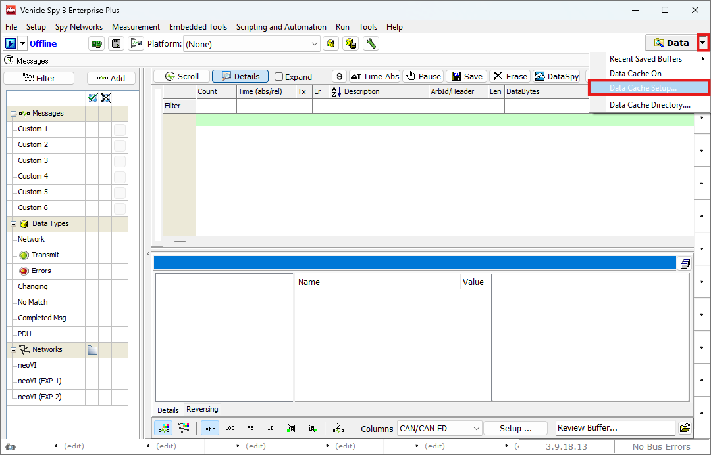
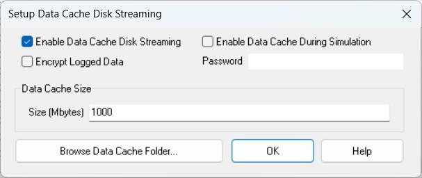

# Data Cache를 사용한 로깅

### 들어가며..

이번 챕터에서는 Data Cache를 활용한 로깅 방법에대해 알아보겠습니다.

### Data Caching

Vehicle Spy 3에서는 앞에 설명한 4가지 로깅 방법 외에도, 데이터를 저장할 수 있는추가적인 방법으로  Data Cache 기능을 제공합니다.

Data Cache 기능을 활성화해두면, 프로그램이 Online 상태가 되는 시점부터 Offline으로 전환되는 시점까지의 데이터가 자동으로 로깅됩니다.

이렇게 저장된 데이터는 .vsb 형태의 파일로 저장되며, Message 단위 로깅 방식입니다.

### 설정하기

메인 화면에서 아래 그림과 같이 Data 옆의 화살표를 눌러 Data Cache Setup... 버튼을 선택합니다.

<figure>

<figcaption>Data Cache Setup</figcaption>
</figure>

Data Cache Setup... 버튼을 누르면 아래와 같은 설정 창이 나타납니다.

<figure>

<figcaption>Data Caching: Setup Data Cache Disk Streaming</figcaption>
</figure>

각 항목에 대한 설명은 다음과 같습니다.

* Enable Data Cache Disk Streaming: Data Cache 기능을 켜고 끌 수 있습니다.
* Enable Data Cache During Simulation: Simulation 모드에서도 Data Cache를 활성화 합니다. 해당 옵션을 선택하지 않으면 장치를 연결하여 Online 시에만 데이터 캐시 기능을 사용합니다.
* Encrypt Logged Data: 해당 기능을 활성화하면 로그 데이터를 암호화하여 저장합니다. 우측의 Password 필터를 통해 비밀번호를 설정할 수 있습니다.
* Data Cache Size: Data Cache가 사용할 저장 공간의 최대 크기를 설정합니다.

  캐시 폴더의 용량이 설정한 크기를 초과하면, 가장 오래된 파일부터 자동으로 삭제됩니다.

  단, 단일 파일 크기가 이 설정값보다 클 경우, 다음 캐싱 작업 전까지는 해당 파일이 유지됩니다.
* Browse Data Cache Folder...: 해당 버튼을 눌러 탐색기에서 캐시 디렉토리를 열 수 있습니다. Data Cache 파일은 아래 경로에 저장됩니다.

> C:\IntrepidCS\Vehicle Spy 3\DataCache

이번 장에서는 네트워크의 데이터를 저장하는 방법에 대해 알아보았습니다.

다음 장에서는 실시간으로 메시지의 신호를 확인하고 분석하는 방법에 대해 알아보겠습니다.
