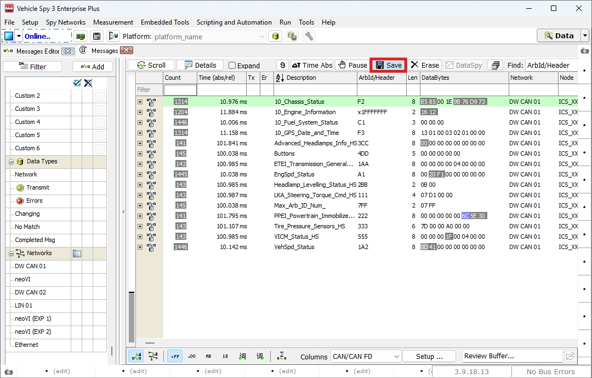
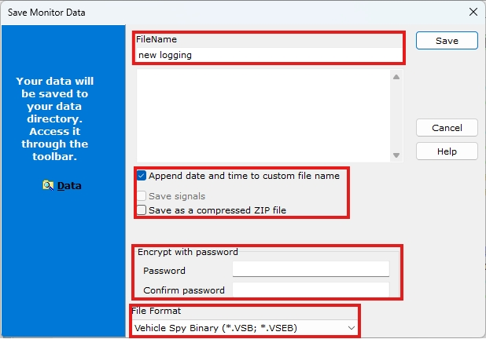
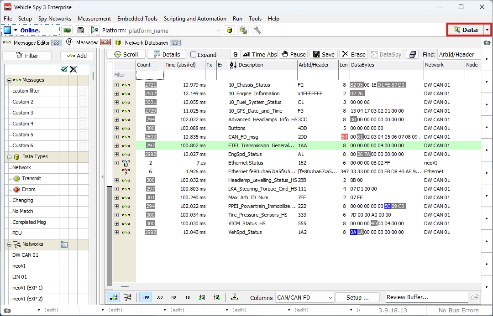

## 들어가며..

이번 챕터에서는 Messages 창의  버튼을 통해 메시지 데이터를 저장하는 방법에 대해 알아보겠습니다.

### Logging with a Save Button

**Vehicle Spy 3** 에서 제공하는 가장 간편한 데이터 저장 방법은 아래 그림과 같이  
**Messages** 창의  버튼을 통해 버퍼에 저장된 메시지를 파일로 저장하는 것입니다.

<figure>

<figcaption>Logging: Save Button in Messages View</figcaption>
</figure>

Save 버튼을 클릭하여 아래 그림과 같이 Save Monitor Data 창을 열어 File Name, 비밀번호, File Format을 설정합니다.

<figure>

<figcaption>Logging: Save Monitor Data</figcaption>
</figure>

가운데 위치한 체크박스에 대해 설명은 다음과 같습니다.

- Append date and time to custom file name: 파일명에 중복이 발생하지 않도록 저장 시점의 날짜와 시간을 파일명 뒤에 자동으로삽입합니다. 만일 이 체크박스를 선택 해제하여 파일명이 중복된다면, 이전 파일이 삭제되고 새로 생성한 로그 파일만 남습니다.

- Save signals: 이 옵션은 .csv 파일로 저장할 때 활성화 가능합니다. 디코딩된 시그널을 CAN 메시지와 병기하여 저장합니다.

- Save as a compressed ZIP file: 파일을 압축하여 .zip 확장자로 저장합니다.

아래 Encrypt with password 부분에서 저장된 파일을 암호화할 수 있습니다. 

File Format 옵션을 통해 어떤 형식으로 저장할 지 선택할 수 있습니다.

이렇게 저장한 로그파일은 데이터 디렉토리에 저장됩니다. 아래 그림과 같이 우측 상단에  버튼을 눌러 저장된 파일을 확인할 수 있습니다.

<figure>

<figcaption>Logging: Data directory</figcaption>
</figure>

