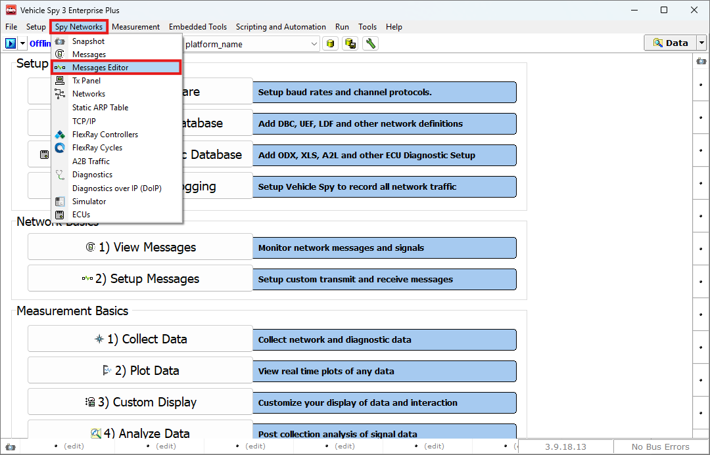

# DBC 파일 편집

### 들어가며..

이번 챕터에서는 등록한 DBC 파일의 내용을 확인하고 이를 수정하여 새로운 파일을 생성하는 방법에 대해 알아보겠습니다.

### DBC 편집

아래 그림과 같이 Spy Networks > Message Editor로 이동합니다.

<figure>

<figcaption>Spy Networks > Messages Editor</figcaption>
</figure>

Vehicle Spy 3의 Messages Editor 탭을 통해 가지고 계신 DBC의 정보를 수정하고 새로운 dbc 파일로 저장할 수 있습니다.

1. 수정하려는 DBC 파일을 등록합니다. DBC 파일 등록 방법은 여기에 소개되어 있습니 다.

<figure>

")
<figcaption>Messages Editor: Edit the DBC file(1)</figcaption>
</figure>

1. Shift+클릭을 이용해 편집을 원하는 데이터 베이스 메시지를 모두 선택한 후 마우스 우클릭, Copy To Receive를 선택합니다.

<figure>

")
<figcaption>Messages Editor: Edit the DBC file(2)</figcaption>
</figure>

3. Receive 탭에서는 아래와 같이 자유롭게 메시지를 수정할 수 있습니다. 메시지의 수정 방법은 여기를 참고하시기 바랍니다.

<figure>

")
<figcaption>Messages Editor: Edit the DBC file(3)</figcaption>
</figure>

수정이 끝나면 Messages Editor 메뉴 상단의  버튼을 눌러 새로운 DBC 파일로 저장합니다.

:::info

만일 Receive 탭과 Database 탭에 같은 메시지가 서로 다른 내용으로 정의되어 있을 경우, Vehicle Spy 3는 Receive 탭을 우선적으로 사용하여 메시지를 디코딩합니다.

:::