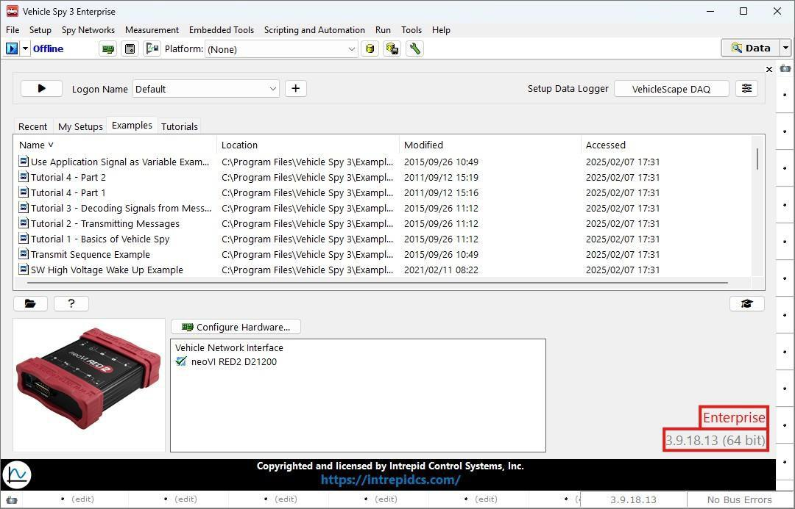
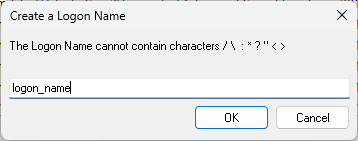
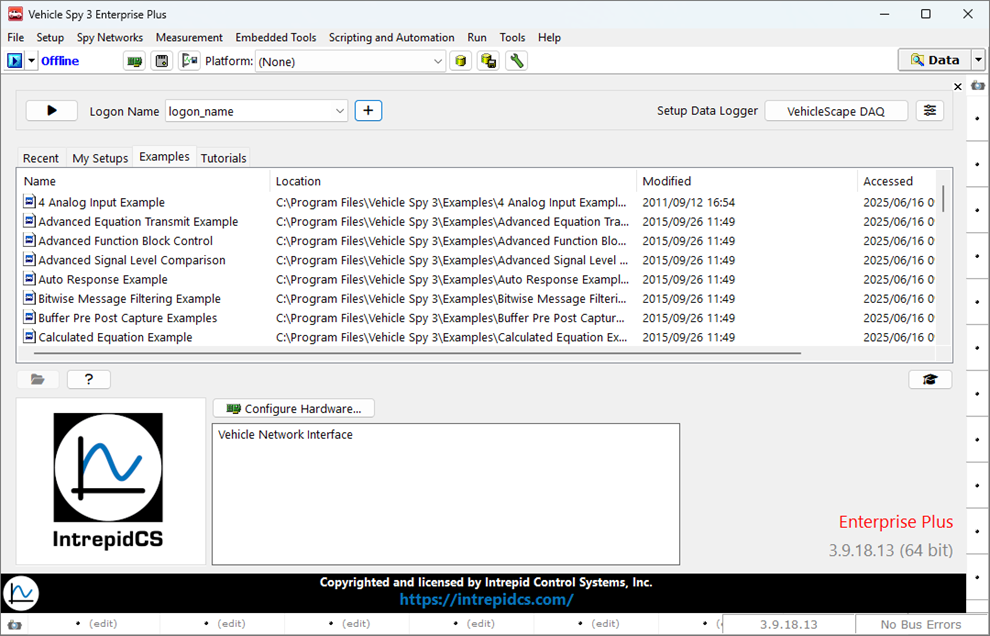
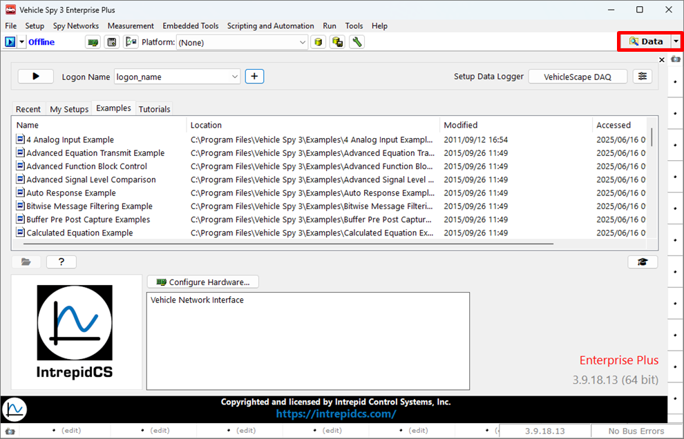
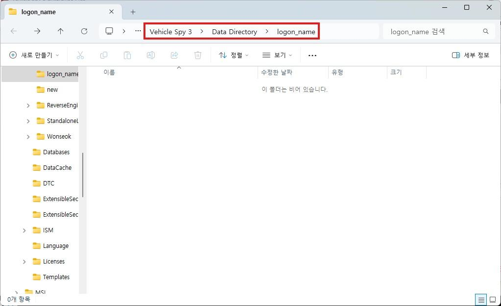

# Logon Name 생성

### 들어가며...

이번 챕터에서는 Vehicle Spy 3의 초기 화면과 Logon Name 생성에 대해 알아보겠습니다.

### 초기 화면 살펴보기

프로그램을 처음 실행하면 아래와 같은 화면이 표시됩니다. 우측 하단에서는 현재 사용 중인 Vehicle Spy 3의 릴리즈 버전과 등급을 확인할 수 있으며, 중앙 하단에는 연결된 장치들의 목록이 표시됩니다.

<figure>

<figcaption>Logon: Version Check</figcaption>
</figure>

## Logon Name 생성하기

Vehicle Spy 3는 Logon Name을 통해 사용자를 구분합니다. 또한, Logon Name을 기반으로 로그 파일,  C Code Interface 파일, 등이 저장되는 Data Directory가 생성어 여러 사용자가 편리하게 사용할 수 있습니다. 데이터 디렉토리의 경로는 다음과 같습니다. 

`C:\IntrepidCS\Vehicle Spy 3\Data Directory\[Logon Name]`

아래 그림에서 볼 수 있듯 기본적으로는 Default가 선택되어 있습니다. 새로운 Logon Name을 생성하려면 + 버튼을 클릭합니다.

<figure>

")
<figcaption>Logon: Create a Logon Name (1)</figcaption>
</figure>

<figure>

<figcaption>Create a Logon Name</figcaption>
</figure>

새로 열린 Logon Name 생성 창에 원하는 이름을 입력한 후, 
OK 버튼을 클릭하여 새로운 Logon Name을 생성합니다.

아래 그림과 같이 새로운 로그온 네임이 생성된 것을 확인하실 수 있습니다.

<figure>

<figcaption>Create a Logon Name (2)</figcaption>
</figure>

우측 상단의  버튼을 누르면 Data Directory로 이동할 수 있습니다.

<figure>

<figcaption>Logon: Data Directory</figcaption>
</figure>

새로 생성된 Data Directory입니다. 여기에 로그파일, CCIF 파일 등이 저장됩니다.

<figure>

<figcaption>Create a Logon Name (3)</figcaption>
</figure>

