# 데이터베이스 플랫폼 생성 및 데이터베이스 파일 (.dbc, .ldf, .arxml) 등록

## 들어가며..

이번 챕터에서는 데이터베이스 플랫폼을 생성하고 데이터베이스 파일을 등록하는 방법에 대해 알아보겠습니다. 등록할 데이터베이스 파일이 없는 경우 [다음 챕터](/data-logging/)로 넘어가 주시기 바랍니다.

## 데이터베이스 플랫폼, 데이터베이스 파일

데이터베이스(.dbc .ldf .arxml 등) 파일을 등록하면 0과 1로 들어오는 메시지 데이터를 의미 있는 값으로 해독(Decoding) 할 수 있습니다.
데이터베이스 플랫폼은 여러 데이베이스 파일들을 효과적으로 관리할 수 있는 집합입니다

## 데이터베이스 플랫폼 생성

데이터베이스 파일을 등록하기 위해서는 데이터베이스 플랫폼 생성이 필요합니다. 플랫폼을 생성하기 위해 상단 메뉴 바에서  버튼을 클릭하거나 Setup > Setup Platforms로 이동합니다. 이 메뉴로 들어가기 위해서는 좌측 상단의 멈춤  버튼을 눌러 Offline 모드로 전환해해야 합니다.

<figure>

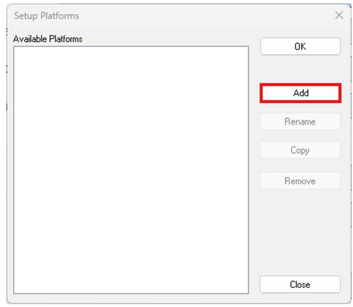
<figcaption>Setup Platforms</figcaption>
</figure>

Add 버튼을 눌러 새로운 플랫폼을 만들어줍니다. 적당하게 구분이 가능한 이름이라면 어떻게 명명하셔도 좋습니다. 주로 차량에서 사용하실 경우, 해당 차량 이름으로 플랫폼 이름을 설정하시면 데이터베이스 파일을 관리하기 편합니다. 

<figure>

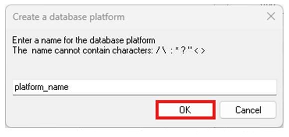
<figcaption>Create a database platform</figcaption>
</figure>

상단 메뉴 바의 Platform을 위에서 설정한 플랫폼으로 설정합니다.

## 데이터베이스 파일  등록

데이터베이스 파일을 등록하기 위해 Platform 옆에 있는  버튼을 클릭하시거나 Setup > Network Databases로 이동합니다.

### • CAN

<figure>

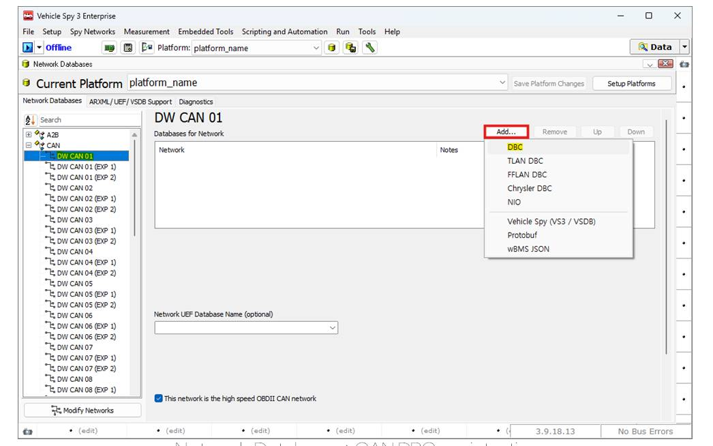
<figcaption>Network Databases: CAN DBC registration</figcaption>
</figure>

좌측의 목록에서 데이터베이스 파일을 등록하기 원하는 네트워크를 선택해줍니다. 
CAN 네트워크를 기준으로 화면의 Add 버튼을 눌러 원하는 포맷의 DBC 파일을 선택합니다.

<figure>

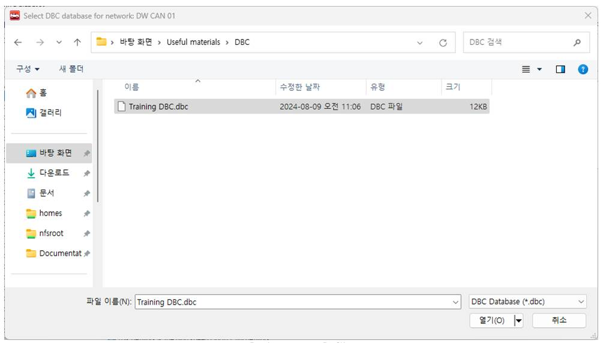
<figcaption>Select DBC file</figcaption>
</figure>

### • LIN

LIN 통신을 사용하는 경우, 좌측에서 사용할 LIN 채널 선택 후  버튼을 눌러 .ldf 파일을 등록합니다. 

<figure>

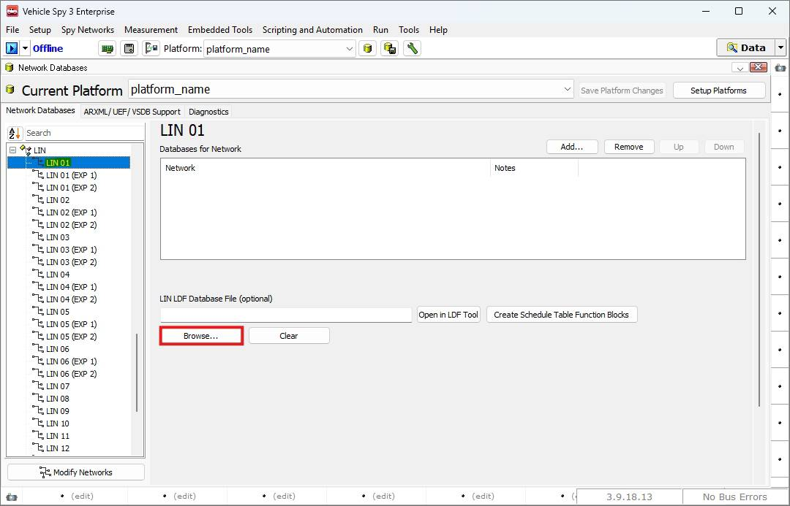
<figcaption>Network Databases: LIN LDF registration</figcaption>
</figure>

<figure>

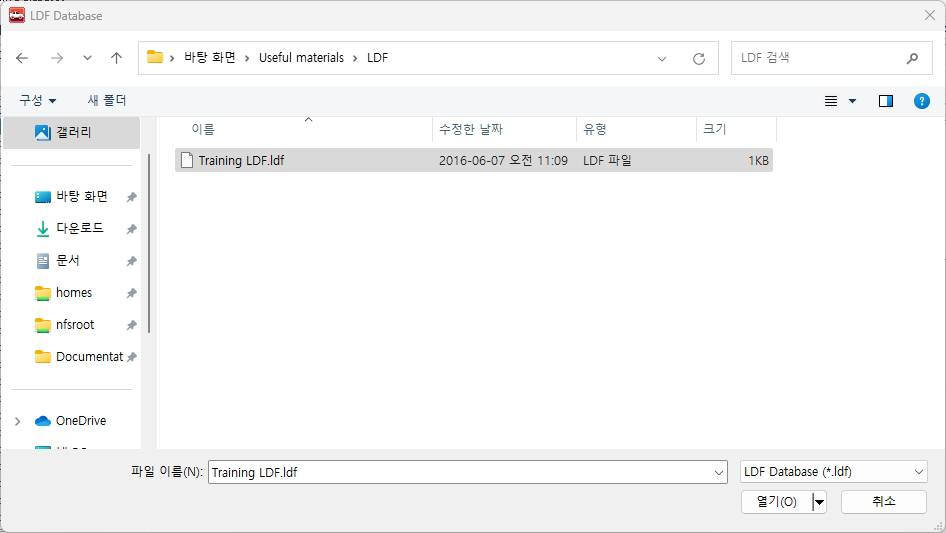
<figcaption>Select LDF file</figcaption>
</figure>

### • AUTOSAR(ARXML)

ARXML 파일을 가지고 계신 경우, 상단의 ARXML/UEF/VSDB Support 탭에서 ARXML.. 버튼을 눌러 등록합니다.

<figure>

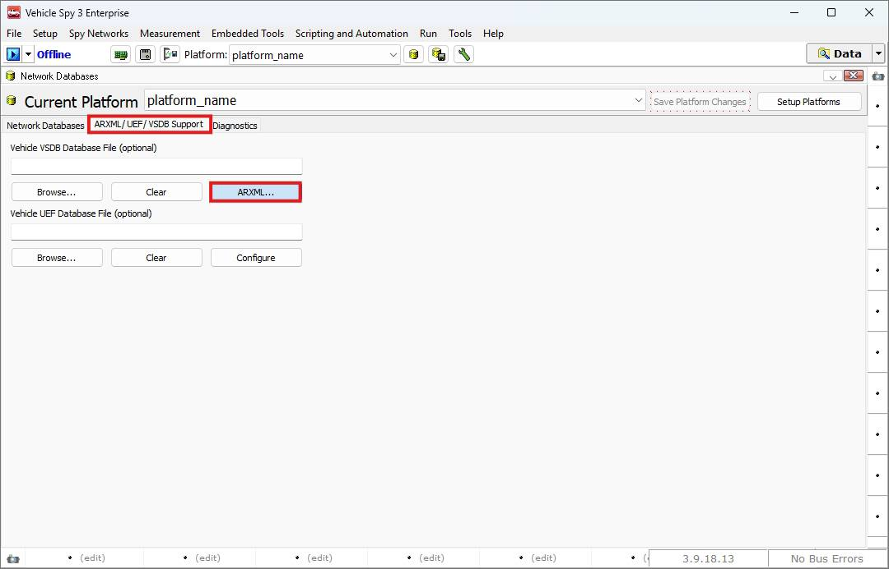
<figcaption>Network Databases: ARXML registration</figcaption>
</figure>

 버튼을 누르면 아래와 같이 ARXML 파일을 등록할 수 있는 ARXML Import 창이 열립니다. 여기에서 Add를 눌러 ARXML 파일을 등록합니다.

<figure>

<figcaption>ARXML Import</figcaption>
</figure>

Add를 눌러 아래와 같이 ARXML 파일을 등록합니다.

<figure>

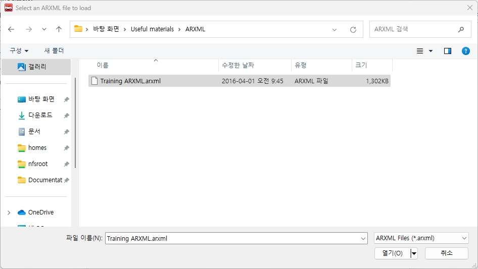
<figcaption></figcaption>
</figure>

 

파일 등록이 끝났으면 아래 그림과 같이 빨간색 박스가 깜빡이는  버튼 또는  를 눌러 플랫폼 설정을 저장합니다.

<figure>

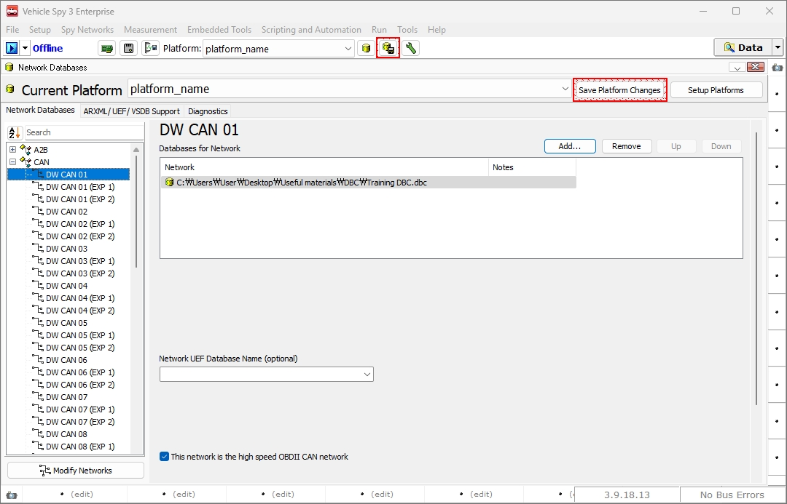
<figcaption>Network Databases: Save Platform Changes</figcaption>
</figure>

 

데이터베이스 등록 이후에는 Spy Networks > Messages Editor 메뉴의 Database 탭에서 등록한 데이터베이스에 정의된 내용을 확인할 수 있습니다. 이 메뉴는 읽기 전용으로 데이터베이스 편집을 원하시면 DBC 파일을 편집하는 방법을 참고하시기 바랍니다.

<!-- 데이터베이스 파일을 등록하고 Messages 창으로 이동하면 아래 그림과 같이 메시지가 해독되어 들어오는 것을 확인할 수 있습니다. -->

<figure>

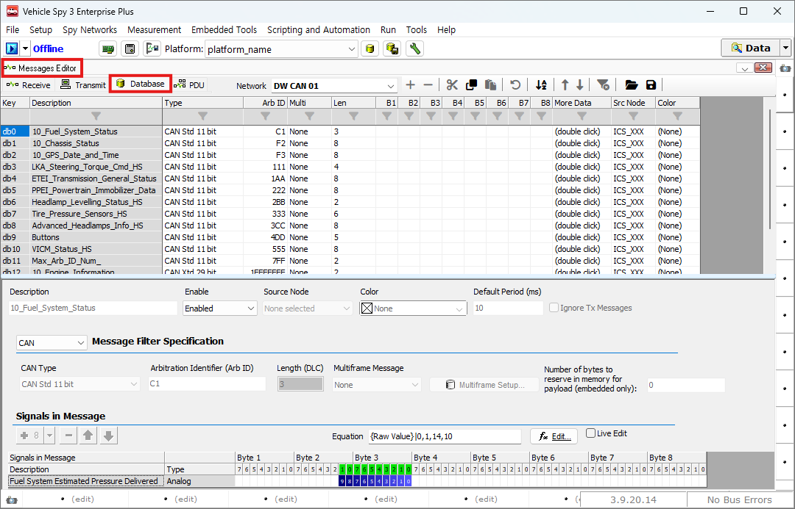
<figcaption>Messages Editor: Database</figcaption>
</figure>

데이터베이스 파일을 등록하고 Messages 창으로 이동하면 이전과는 달리 메시지가 해독되어 들어오는 것을 확인할 수 있습니다.

<figure>

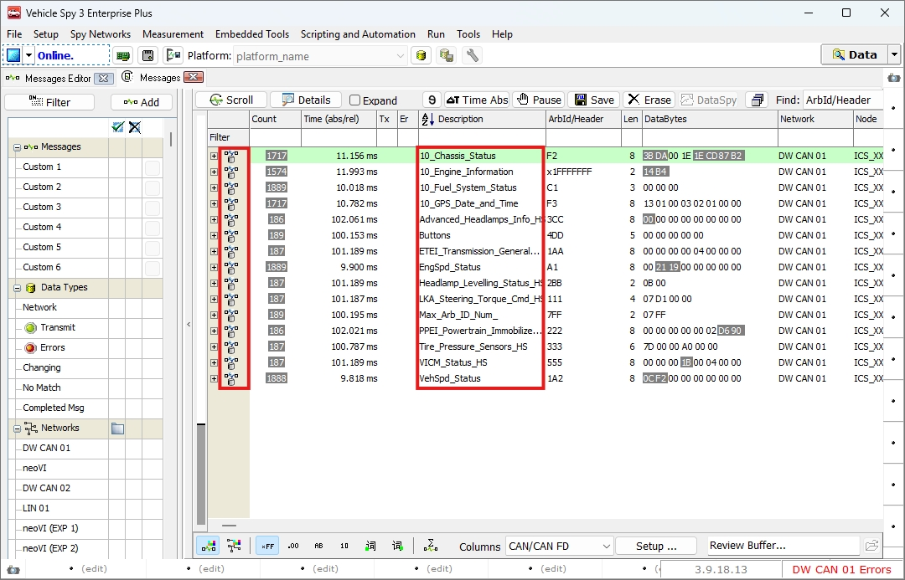
<figcaption>Messages 창: 데이터베이스 파일 등록 후(1)</figcaption>
</figure>

또한, 아래 그림과 같이 좌측의 + 버튼을 눌러 메시지 내의 신호 이름과 값, 그리고단위를 확인할 수 있습니다.

<figure>

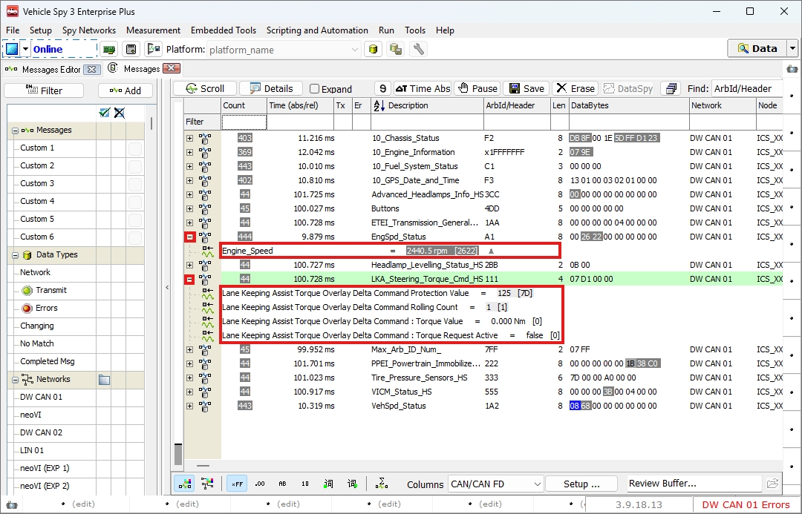
<figcaption>Messages 창: 데이터베이스 파일 등록 후(1)</figcaption>
</figure>

아래의 DBC 파일 등록과 메시지 보기 영상을 통해 영상으로도 관련 내용을 확인하실 수 있습니다.

※ [‘DBC파일 등록’과 ‘메세지 보기’사용법에 대한 동영상](https://screencast-o-matic.com/watch/cojXhzfa1a)

