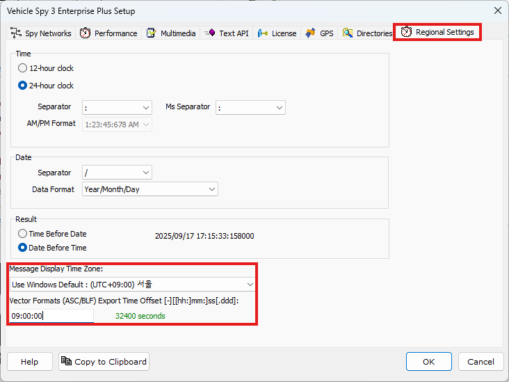

# 기본 설정

본격적으로 시작하기에 앞서 기본적인 설정을 진행하겠습니다. 아래의 그림과 같이

Tools > Options... 버튼을 눌러 옵션 메뉴로 진입합니다.

<figure>

<figcaption>Tools > Options</figcaption>
</figure>

설정창이 열리면 우측 상단의 Regional Settings 탭으로 이동 후 아래 그림과 같이 Message Display Timezone을 UTC+9로 설정하고, Vector Formats Export Time Offset에 09:00:00을 입력해줍니다.

이는 벡터 포맷으로 변환할 때 타임스탬프를 한국 시간(KST)으로 보정하기 위한 설정입니다.

<figure>

<figcaption>Options: Regional Settings</figcaption>
</figure>

