# 하드웨어 설정

## 들어가며..

이번 챕터에서는 장치와 PC를 연결하고 장치를 올바르게 설정하는 방법에 대하여 알아보겠습니다.

## Hardware Settings

상단메뉴의 Setup > Hardware 혹은 아래 그림과 같이  버튼을 눌러 하드웨어 설정 메뉴로 들어갑니다.

<figure>

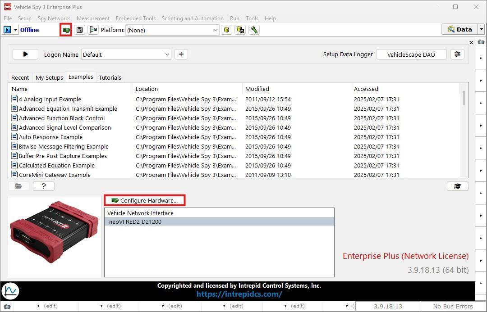
<figcaption>Main Pages</figcaption>
</figure>

## neoVI Explorer

Vehicle Spy 3는 neoVI Explorer라는 프로그램을 사용하여 장치의 설정을 변경합니다.

<figure>

<figcaption>neoVI Explorer</figcaption>
</figure>

## System Settings

System Settings 탭에서는 neoVI Explorer의 기본 설정을 할 수 있습니다.

<figure>

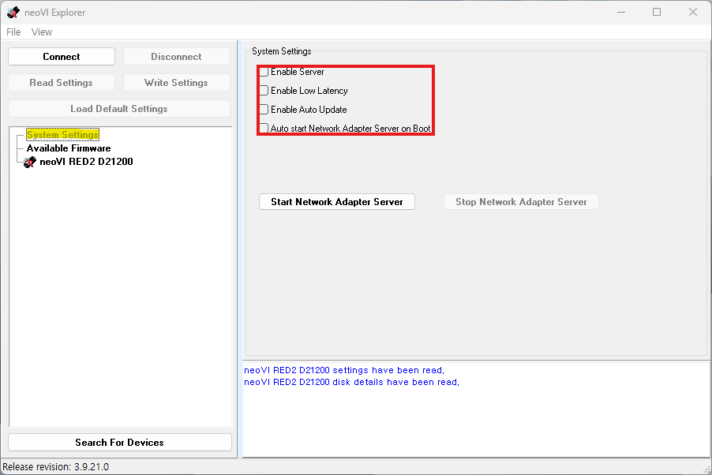
<figcaption>neoVI Explorer: System Settings</figcaption>
</figure>

System Settings의 각 메뉴에 대한 설명은 다음과 같습니다.

*   Enable Server: 이 옵션은 장치의 자체 서버 기능을 사용할지 여부를 설정합니다. 이 설정 은 일종의 단독 모드와 유사합니다. 이 옵션이 비활성화되어 있으면, 하나의 장치는 하나의 Vehicle Spy 3에서만 인식됩니다. 반면, 이 옵션을 활성화하면 하나의 장치를 둘 이상의 Vehicle Spy 3에서 동시에 사용할수 있습니다.
    
*   Enable Low Latency: USB 통신의 레이턴시를 줄여 USB 데이터를 더 빠르게 읽으려고 시도하는 기능입니다. Jitter 등의 이유로 기본적으로는 비활성화를 권장합니다.
    
*   Enable Auto Update: 이 옵션을 활성화하면, 장치가 연결될때마다 장치의 펌웨어(FW) 버전을 체크하여 Vehicle Spy의 펌웨어 버전과 맞지 않는 경우, 자동으로 펌웨어 업데이트를 진행하는 기능입니다.
    
*   Auto Start Network Adaptor Server on Boot: 이 기능은 컴퓨터가 장치를 네트워크 인터페이스로 인식하도록 설정하는 기능입니다. 이 기능을 활성화하면 시스템 부팅 시 자동으로 네트워크 장치로 인식되어 연결됩니다 (이 기능은 이더넷 포트가 있는 장치에서만 적용이 가능합니다.)

## 장치 연결하기

neoVI Explorer를 통해 장치를 연결하고 장치의 세팅을 변경하기 위해 다음의 단계를 따릅니다.

- 연결할 장비 이름을 클릭합니다.   (만일 연결된 장치가 목록에 표시되지 않을 경우, 좌측 하단의 Search For Devices 버튼을 눌러 목록을 새로고침 해줍니다.)
- ‘Connectʼ 버튼을 누릅니다.

<figure>

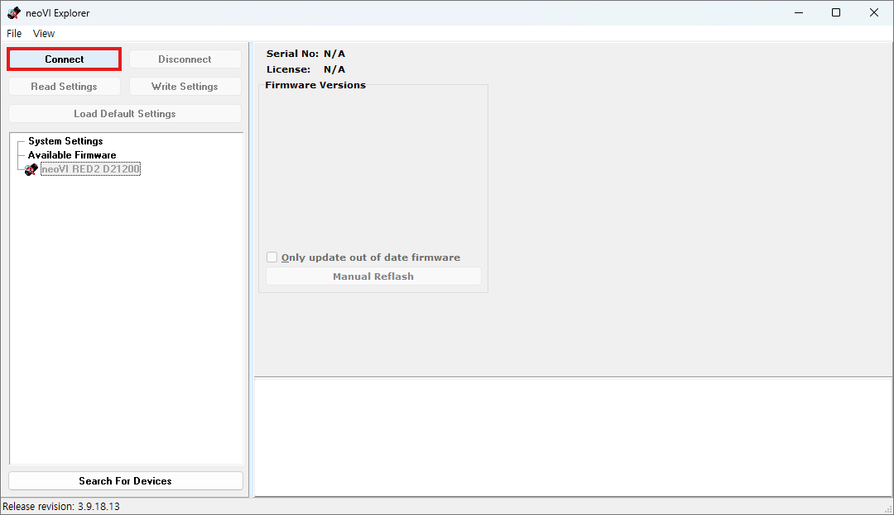
<figcaption>neoVI Explorer: Connect a Device</figcaption>
</figure>

Connect 버튼을 누르면  기본적으로 아래 그림과 같이 General Settings 탭이 열리게 됩니다. 

## General Settings

Connect 버튼을 누르면 아래 그림과 같이 General Settings 탭이 열리게 됩니다. 

여기에서는 장치의 펌웨어 버전을 확인하고, 펌웨어를 업데이트 할 수 있는 기능과, 장치의 클락을 PC의 시간과 동기화 할 수 있는 기능을 제공합니다.

Vehicle Spy 3는 릴리즈 버전마다 장치와 사용이 가능한 펌웨어 버전이 다르기 때문에, 장치를 프로그램과 올바르게 사용하려면 펌웨어 버전을 맞춰주어야 합니다.

아래 그림과 같이 화면 중앙에서 현재 사용 중인 펌웨어의 버전을 확인하실 수 있습니다. 장치의 펌웨어 버전이 현재 사용 중인 Vehicle Spy 3의 버전과 호환되면 글자가 검은색으로 표시됩니다.

<figure>

")
<figcaption>neoVI Explorer: General Settings(1)</figcaption>
</figure>

반대로 장치의 펌웨어가 호환되지 않는 경우에는 아래 그림처럼 빨간색으로 표시되며, 장치의 정상적인 사용을 위해서는 'Manual Reflash' 버튼을 눌러 펌웨어를 업데이트 해야합니다.

<figure>

")
<figcaption>neoVI Explorer: General Settings(2)</figcaption>
</figure>

Manual Reflash 버튼을 누르면 아래 그림과 같이 bootloader를 통해 장치의 펌웨어를 업데이트 하게 됩니다.

<figure>

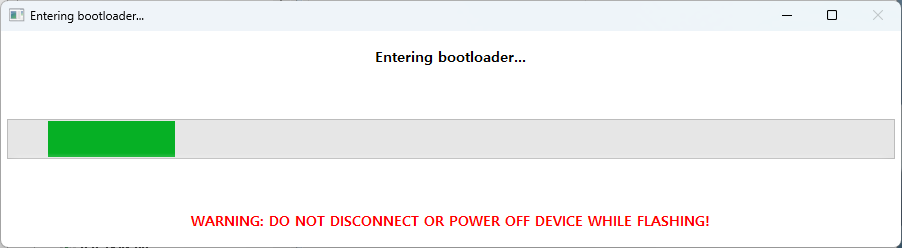
<figcaption>Bootloader: Firmware Update</figcaption>
</figure>

펌웨어 업데이트는 장비의 핵심 소프트웨어를 수정하는 과정이므로, 업데이트 중에 장비와 PC의 연결을 끊거나 전원 공급을 차단하면 업데이트가 중단되거나 펌웨어 손상이 발생 할 수 있습니다. 이로 인해 장비에 문제가 발생할 수 있으므로, 펌웨어 업데이트 중에는 절대로 PC와의 연결을 끊거나 전원을 차단하지 않도록 주의하십시오.

<figure>

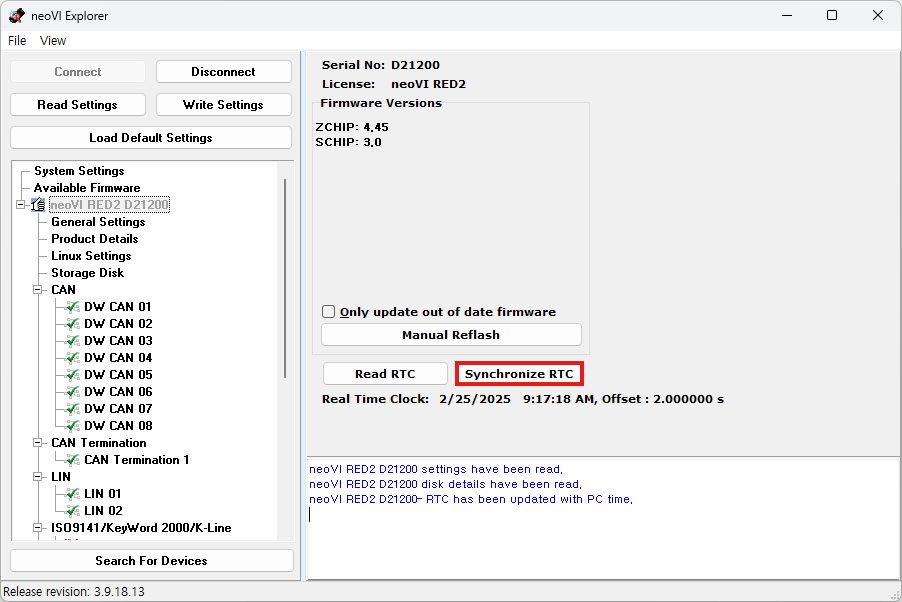
<figcaption>neoVI Explorer: Synchronize RTC</figcaption>
</figure>

ICS의 장치에는 RTC(Real-Time Clock)가 내장되어 있어, 별도의 PC 없이 장비 단독으로 로깅을 진행할때에도 로깅 파일에 정확한 타임스탬프를 기록할 수 있습니다.

Read RTC 버튼을 눌러 현재 장치 클럭의 시간을 확인할 수 있습니다.

Synchronize RTC 버튼을 통해 장치의 클락을 PC의 시간과 동기화할 수 있습니다.

## Storage Disk

RAD-Gigastar, RAD-Galaxy, neoVI RED 2, neoVI FIRE Series 등 Standalone Data logging을 지원하는 장치에는 SD 카드를 장착하여 장치 단독 로깅기능을 사용할 수 있습니다.

이 기능을 사용하기 위해 좌측의 리스트에서 Storage Disk 탭을 통해 장치에 장착한 SD카드의 포맷과 설정을 할 수 있습니다.

<figure>

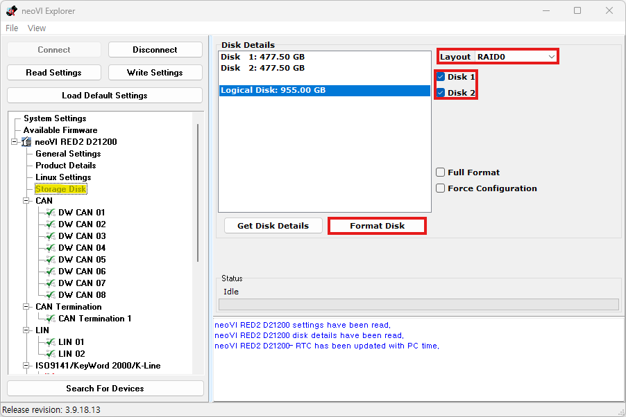
<figcaption>neoVI Explorer: Storage Disk</figcaption>
</figure>

각 메뉴에 대한 설명은 다음과 같습니다.

* Layout: 디스크의 포맷 방식을 설정합니다. Spanned / RAID 0 중 하나의 옵션을 선택하실 수 있습니다. 
하나의 SD 카드를 사용하실 경우 Spanned 방식을 권장드립니다.
* 사용을 원하시는 디스크를 선택하신 후 아래의 Format Disk 버튼을 통해 포맷을 진행합니다.
* Full Format: 디스크의 Low level format을 진행합니다. 다소 시간이 소요될 수 있습니다.
* Force Configuration: 디스크를 포맷하지 않고 Layout 설정만 변경할 수 있는 옵션입니다.*

## CAN Networks

Vehicle Spy 3에서는 CAN 채널을 DW CAN(Dual-wire CAN)이라고 명명합니다. 

네트워크의 설정을 위해 사용을 원하는 CAN 채널을 선택해줍니다.

<figure>

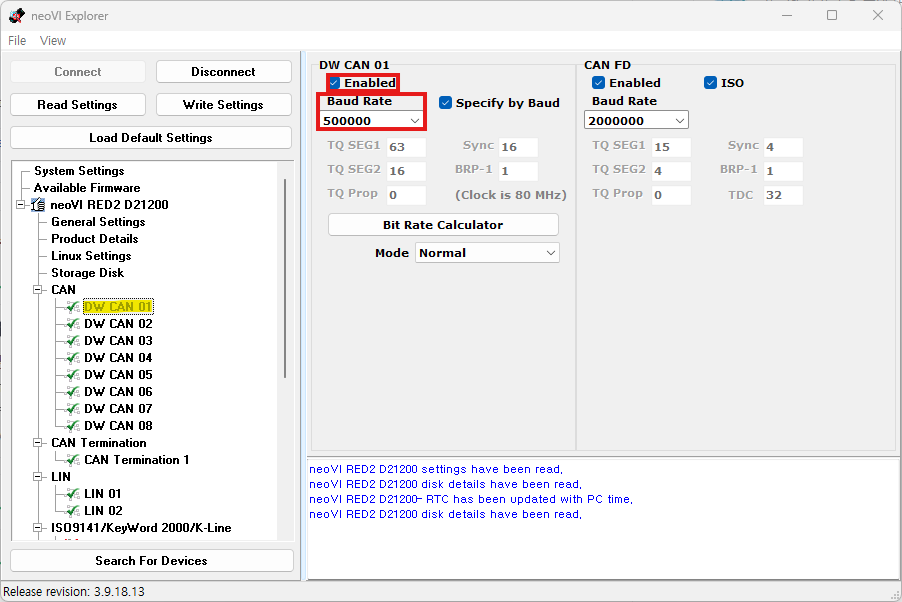
<figcaption>neoVI Explorer: CAN Networks</figcaption>
</figure>

좌측에서 CAN 2.0 네트워크를, 우측에서 CAN FD 네트워크의 설정을 변경할 수 있습니다. 

각 메뉴에 대한 설명은 다음과 같습니다.

* Enabled: 네트워크의 사용 여부를 선택합니다.
* Specify by Baud: 해당 체크박스를 선택하면 Baud Rate에 맞는 Time Quanta, Sync 등의 옵션을 자동으로 설정됩니다. CAN Bit Timing을 수동으로 선택하기 위해서 해당 체크박스를 선택 해제 후 아래의 필드를 수동으로 입력합니다.
* Baud Rate: 장비의 통신 속도를 설정합니다.
이 옵션은 연결하려는 네트워크의 설정과 동일하게 맞춰주어야 합니다.
* Bit Rate Calculator: 인트레피드의 bit rate calculator를 실행합니다.
해당 프로그램을 통해 손쉽게 CAN bit timing을 계산할 수 있습니다.
* Mode: PHY의 동작 모드를 설정합니다. Normal 모드는 메시지를 송수신합니다. Listen Only 모드는 passive 모드로 메시지를 수신만하고 송신하지는 않습니다.

## CAN Termination

이 메뉴는 CAN 통신을 지원하는 장비에서 소프트웨어적으로 종단저항을 켜거나 끌 수 있는 메뉴입니다.

<figure>

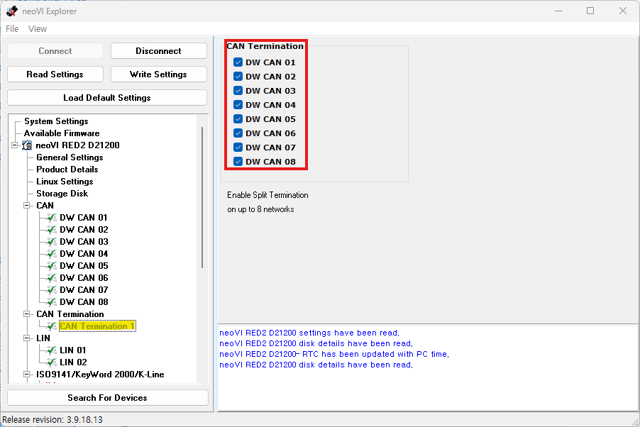
<figcaption>neoVI Explorer: CAN Termination</figcaption>
</figure>

종단 저항을 사용하려는 채널의 체크박스를 선택하여 종단 저항을 활성화해줍니다. 

\* 차량과 같이 이미 종단 저항이 있는 네트워크에 장치를 연결하여 사용할 경우에는 종단 저항을 비활성화합니다.

## LIN Networks

이 메뉴는 LIN 통신을 지원하는 장비의 LIN Network 설정을 변경할 수 있는 메뉴입니다.

<figure>

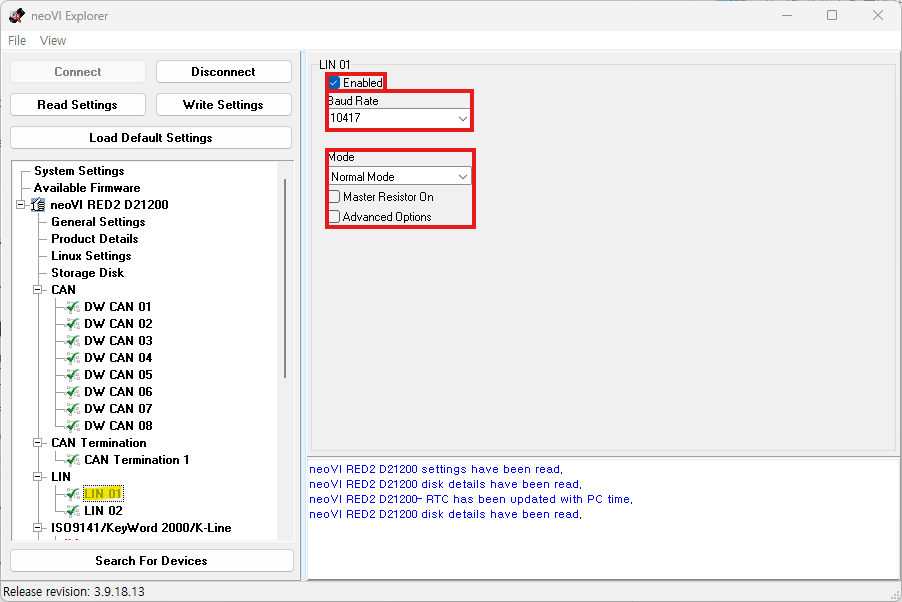
<figcaption>neoVI Explorer: LIN Networks</figcaption>
</figure>

해당 메뉴에 대한 설명은 다음과 같습니다.
- Enabled: 해당 체크박스를 선택하여 네트워크를 활성화합니다.
- Baud Rate: 장비의 통신 속도를 설정합니다.
- Mode: Sleep Mode, Slow Mode, Normal Mode, Fast Mode 중 하나의 옵션을 선택 할 수 있습니다.
- Master Resistor On: 이 옵션을 활성화하면 1KΩ의 소프트웨어 풀업 저항을 사용하여 해당 디바이스가   Master Node 역할을 수행합니다.
- Advanced Options: 해당 체크박스를 선택하여 LIN 네트워크의 고급 설정을 사용할 수 있습니다. 마스터 ID와 첫 번째 슬레이브 바이트 사이의 대기시간을 수동 으로 선택하거나, LIN 통신에서 발생하는 오류를 상세하게 표시하는 기능을 제공합니다.

## Ethernet Networks

이 메뉴는 Ethernet을 지원하는 장비의 포트 설정을 하실 수 있는 메뉴입니다.

<figure>

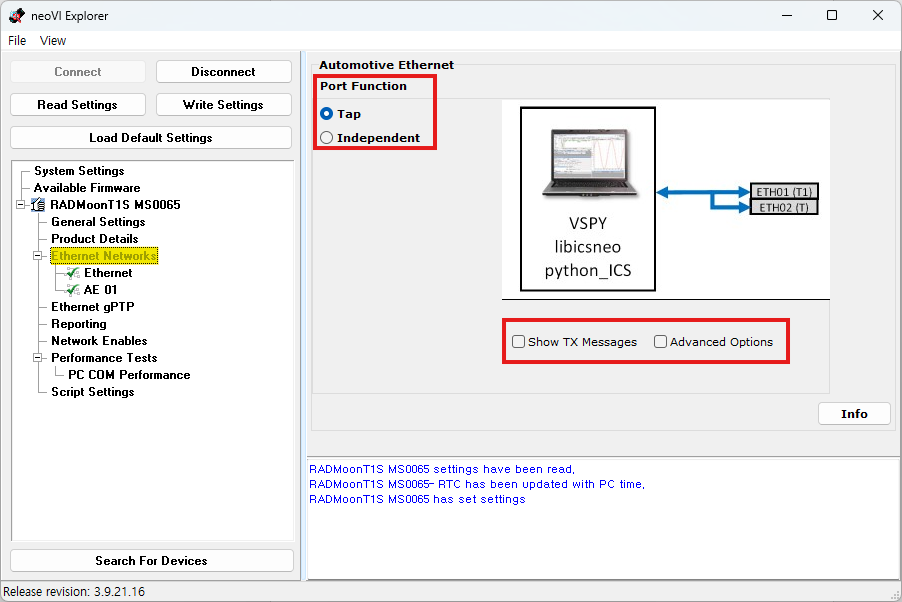
<figcaption>neoVI Explorer: Ethernet Networks</figcaption>
</figure>

해당 메뉴에 대한 설명은 다음과 같습니다.

- Port Function: 장치의 설정을 Tap 혹은 Independent 모드 중 선택할 수 있습니다.
- Show Tx Messages: Vehicle Spy와 함께 사용할 때, 컨버팅하여 송신하는 메시지도 표시합니다.
- Advanced Options: 해당 체크박스를 선택하여 T1S Decoder를 비활성화 할 수 있는 기능을 제공합니다.

## Ethernet

이 메뉴는 Ethernet을 지원하는 장비의 Ethernet Network 설정을 하실 수 있는 메뉴입니다.

<figure>

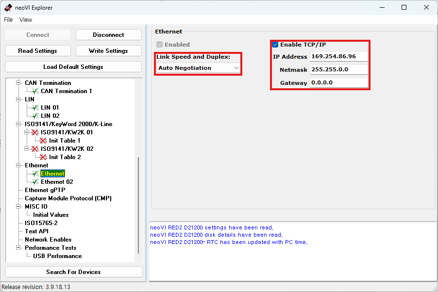
<figcaption>neoVI Explorer: Ethernet</figcaption>
</figure>

해당 메뉴에 대한 설명은 다음과 같습니다.
- Link Speed and Duplex: 장치의 통신속도 및 전송 방식을 설정하실 수 있는 메뉴입니다.   전송방식은 반이중 전송과 전이중 전송 중 선택할 수 있습니다.
- Enable TCP/IP: TCP/IP 통신을 켜고 끌 수 있는 버튼입니다.   아래의 필드에서 IP 주소, 네트워크 마스크, 및 게이트웨이를 입력할 수 있습니다.

## Automotive Ethernet (10BASE-T1S)

RAD-COMET2, RAD-COMET3, RAD-Moon-T1S, 등 10BASE-T1S 통신을 지원 하는 장치에서 해당 네트워크를 설정할 수 있는 메뉴입니다.

<figure>

")
<figcaption>neoVI Explorer: Automotive Ethernet(10BASE-T1S)</figcaption>
</figure>

상단의 메뉴는 Ethernet 설명과 동일합니다. 

10BASE-T1S 설정은 다음과 같습니다.

- Enable PLCA: 10BASE-T1S의 PLCA(Physical Layer Collision Avoidance) 기능을 켜고 끌 수 있습니다. 이 기능을 활성화할 경우 PLCA의 Beacon을 사용하여 매체의 접속을 제어합니다. 이 기능을 비활성화할 경우 기존 이더넷과 같이 CSMA/CD 방식을 사용하여 매체의 접속을 제어합니다. CSMA/CD 방식은 Collision Detection시 Random backoff timing 을 사용하여 메시지 재전송을 시도합니다.
- Show Special Symbols: SSD, ESD 등 10BASE-T1S에서 사용되는 Special Symbol의 내용을 메시지 창에 표시할 수 있습니다.
- Show Beacons: 메시지 창에 매체 제어에 사용되는 Beacon 신호를 표시하거나 숨길 수 있는 옵션입니다.
- Local ID: 노드 간 통신에서 사용하는 ID입니다. ID 값이 0인 노드는 Coordinator 역할을 하며, 네트워크에는 반드시 0번 ID를 갖는 노드가 존재하여야 합니다.
- Max Nodes: 네트워크에 사용될 최대 노드 숫자를 입력합니다.
- TX Opp Timer: 노드가 전송 기회를 잃었을 때 다음 전송 기회가 오기까지 기다려야 하는 시간을 설정합니다. 기본 값은 32(bit time)입니다.
- Max Burst: 한 사이클 동안 노드가 전송할 수 있는 최대 버스트 프레임 숫자를 설정합니다.
- Burst Timer: 프레임 전송을 마치고 버스트 프레임을 전송할 수 있는 시간을 설정합니다. 만약 이 시간이 지나기 전에 버스트 프레임이 전송되지 않으면, 다음 노드로 전송 기회가 넘어갑니다.

## 그 밖의 기능들

Ethernet gPTP(Generalized Precision Time Protocol): IEEE 802.1AS에서 정의된 이더넷을 사용한 Clock Sync Protocol 기능을 지원합니다.

<figure>

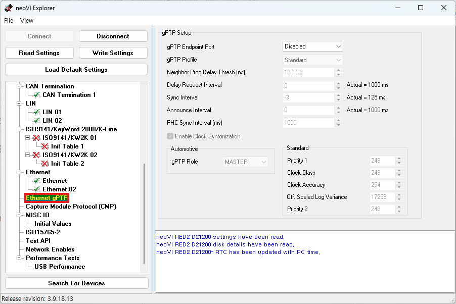
<figcaption>neoVI Explorer: Ethernet gPTP</figcaption>
</figure>

ASAM社에서 정의한 CMP 프로토콜을 지원합니다.

<figure>

")
<figcaption>neoVI Explorer: Ethernet Capture Module Protocol(CMP)</figcaption>
</figure>

MISC IO (Miscellaneous I/O) 탭에서는 그외의 입력들에 대해 설정할 수 있습니다.

<figure>

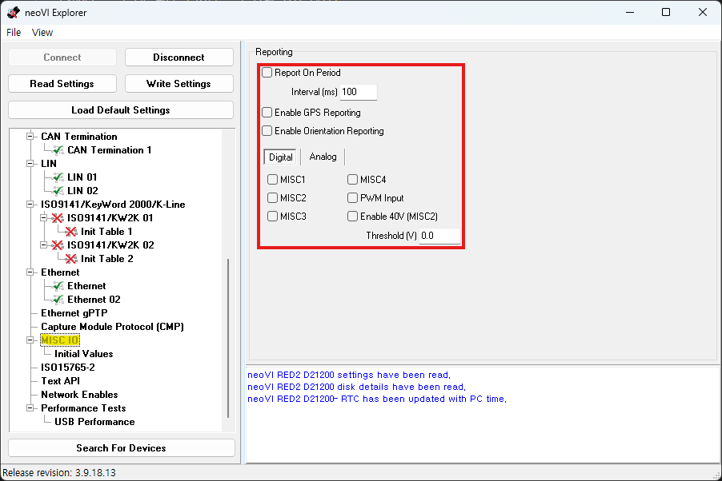
<figcaption>neoVI Explorer: MISC IO</figcaption>
</figure>

각 메뉴에 대한 설명은 아래와 같습니다.

- Report On Period: 해당 옵션을 선택하면 주기적으로 Report Message를
송신합니다. neoVI 네트워크에 정의된 Report Message에는 보드 및 칩셋의 온도, 디지털 및 아날로그 입력 값, 장치에 들어오는 전압, 등을 포함하고 있습니다.
- Enable GPS Reporting: 해당 옵션을 선택하면 위도, 경도, 고도, 정확도, 등 GPS와 관련된 신호를 송신합니다. 장치에 별도의 External GPS 안테나를 사용하면 더욱 정밀한 결과를 얻을 수 있습니다.
- Enable Orientation Reporting: 해당 옵션을 선택하면 장치에 내장된 9축 IMU 센서의 값을 송신합니다.

하단의 Digital, Analog 탭에서 사용을 원하는 채널을 선택하여 해당 채널에서 들어오는 입력 값의 변화를 모니터링 할 수 있습니다.

## 설정 저장하기

설정을 완료하셨다면, 아래 그림과 같이 우측 상단의 Write Settings 버튼을 클릭하여 변경 한 설정을 하드웨어에 저장할 수 있습니다.
만약 설정을 잘못 변경했거나 문제가 발생한 경우에는, Load Default Settings 버튼을 클릭하여 기본값으로 초기화할 수 있습니다.
또한, 아직 Write Settings를 클릭하지 않았다면, Read Settings 버튼을 통해 현재 장치의 설정 값을 다시 불러올 수 있습니다.

<figure>

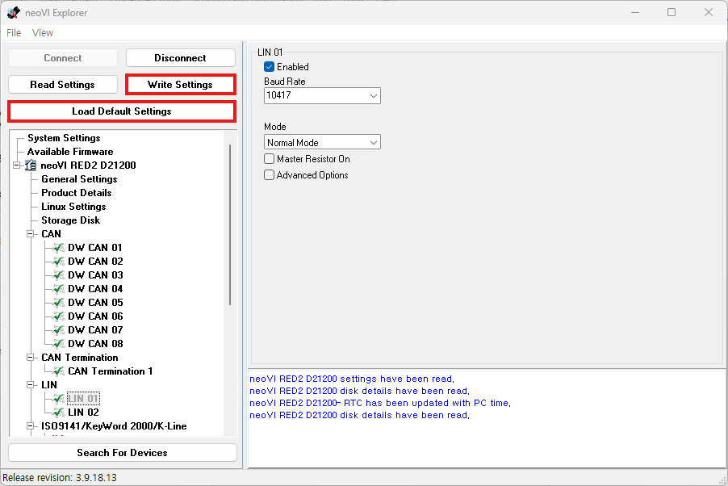
<figcaption>neoVI Explorer: Write Settings</figcaption>
</figure>

Write Settings으로설정을 저장하셨으면, Disconnect 버튼을 클릭하여 연결 해제 후 창을 닫아 주세요.