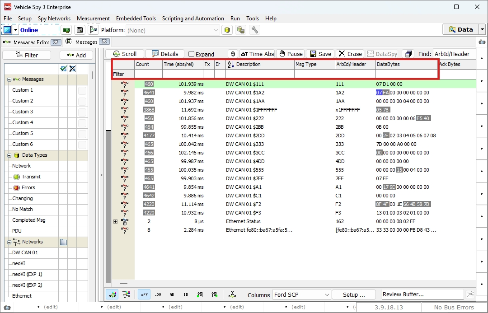
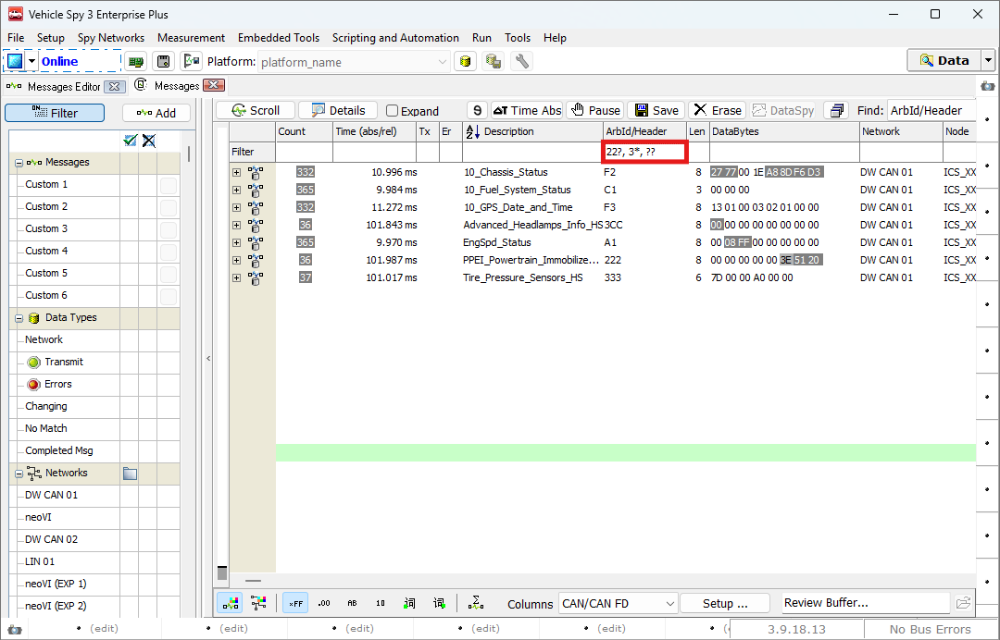
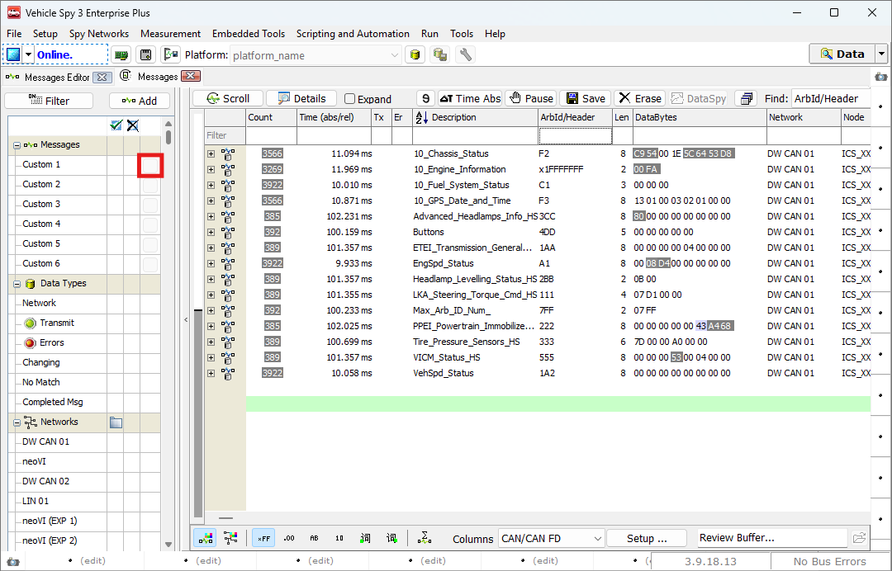
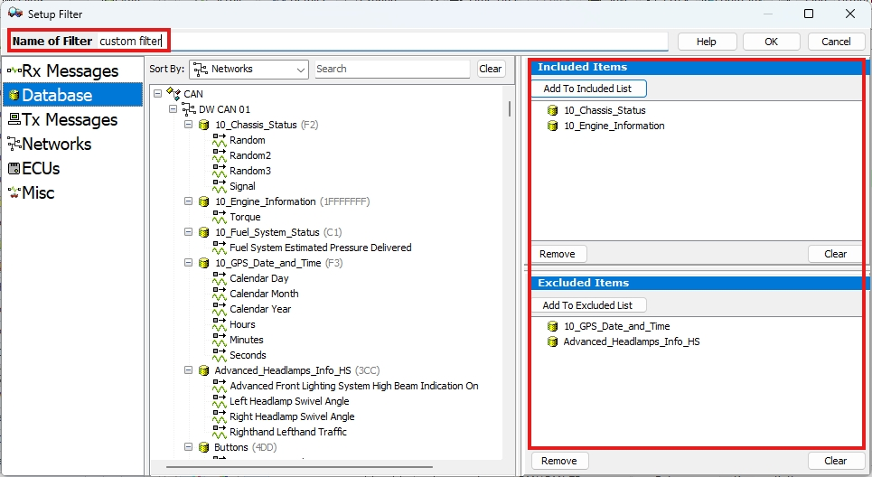
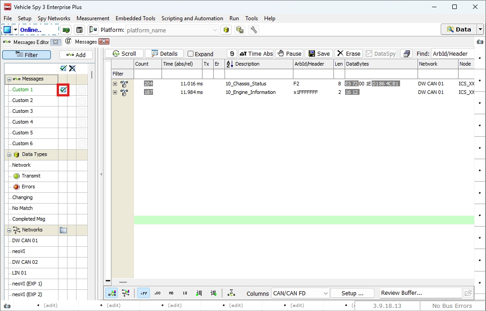
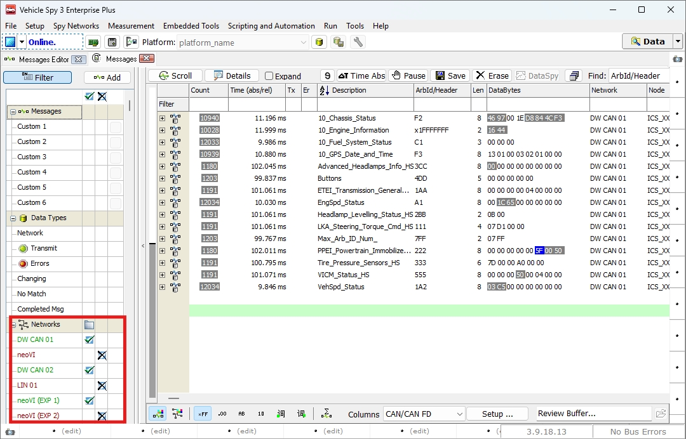

# 메시지 필터링

## 들어가며..

이번 챕터에서는 원하는 메시지만 화면에 보이게 할 수 있는 메시지 필터링에 대해 알아보겠습니다.

## 메세지 필터링

Vehicle Spy 3에서는 실시간으로 들어오는 여러 메시지 중 원하는 메시지만 보기 위해 메시지 필터 기능을 제공합니다. 가장 편리하게 설정하는 방법은 아래 그림과 같이 상단의 Filter 부분을 활용하는 것입니다.

<figure>

<figcaption>Messages Filtering(1)</figcaption>
</figure>

Filter 옆의 흰 부분을 더블클릭하여 입력 창으로 전환한 후, 원하는 필터 조건을 입력합니다. 기본적으로는 문자열에 일치하는 문자가 있는 경우만 화면에 표시됩니다. 단, ArbID 필드의 경우 모든 문자가 일치해야 합다. 아래 그림처럼 , 를 통해 여러 조건을  OR 옵션으로 적용할 수 있으며, 각 필드 간 조건은 AND로 적용됩니다. 추가적으로 문자열 연산에서 와일드카드 '?', '*'를 사용할 수 있습니다.

<figure>

<figcaption>Messages Filtering(2)</figcaption>
</figure>

이 외에도 문자열 기반의 검색이 아닌 다른 방법으로 좌측의 Filter 기능을 사용할 수 있습니다. 아래 그림과 같이 Messages 좌측의 버튼을 눌러 원하는 필터를 설정할 수 있습니다.

<figure>

<figcaption>Messages Filtering(3)</figcaption>
</figure>

버튼을 클릭하면 아래 그림과 같이 Setup Filter 창이 열립니다. 여기서 상단의 Name of Filter에서 필터의 이름을 지정해 줍니다. 중앙 부분에서 원하는 메시지를 선택한 후, 우측의 Included Items 또는 Excluded Items 필드로 드래그하여 넣습니다. 원하는 메시지를 모두 선택했다면, OK 버튼을 클릭하여 창을 닫습니다.

<figure>

<figcaption>Messages Filtering: Setup Filter</figcaption>
</figure>

창을 닫으면 자동으로 필터가 적용됩니다. 우측의 Filter에서 체크 표시로 활성화된 것을 확인할 수 있습니다. 아무것도 설정하지 않은 필터의 경우, 전체 메시지가 표시되며, 우측의 X 표시를 클릭하면 해당 메시지를 제외하고 나머지 메시지만 표시하는 기능도 지원됩니다.

<figure>

<figcaption>Messages Filtering(4)</figcaption>
</figure>

이 외에도 아래 사진과같이 네트워크 별로 필터링 하는 기능도 지원합니다.

<figure>

<figcaption>Messages Filtering(5)</figcaption>
</figure>

