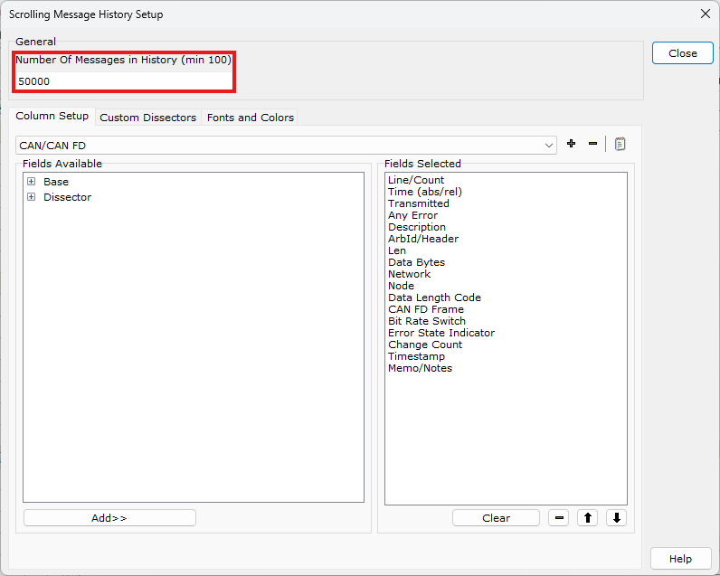
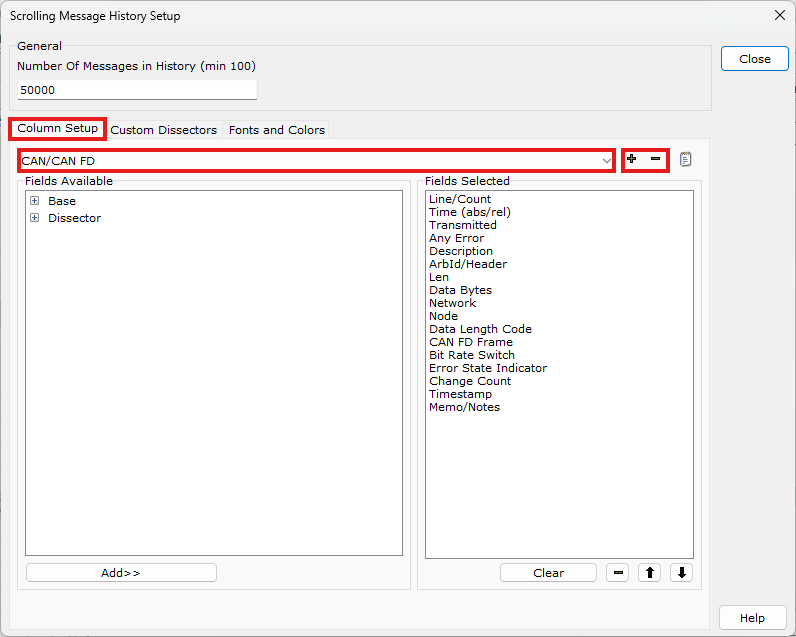
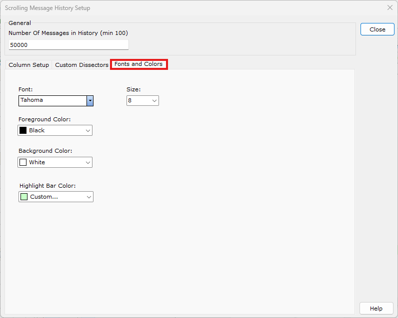
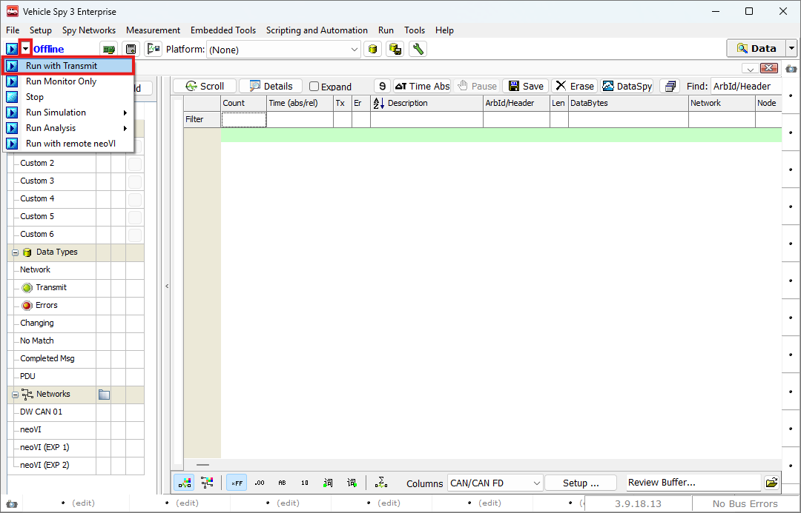
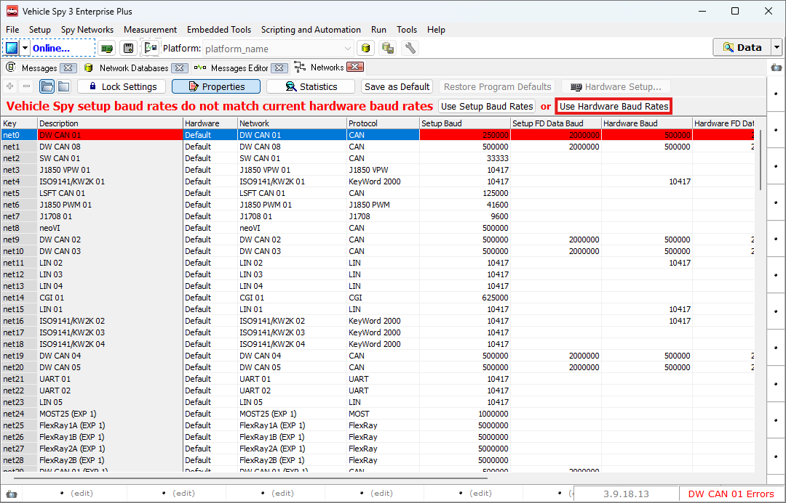
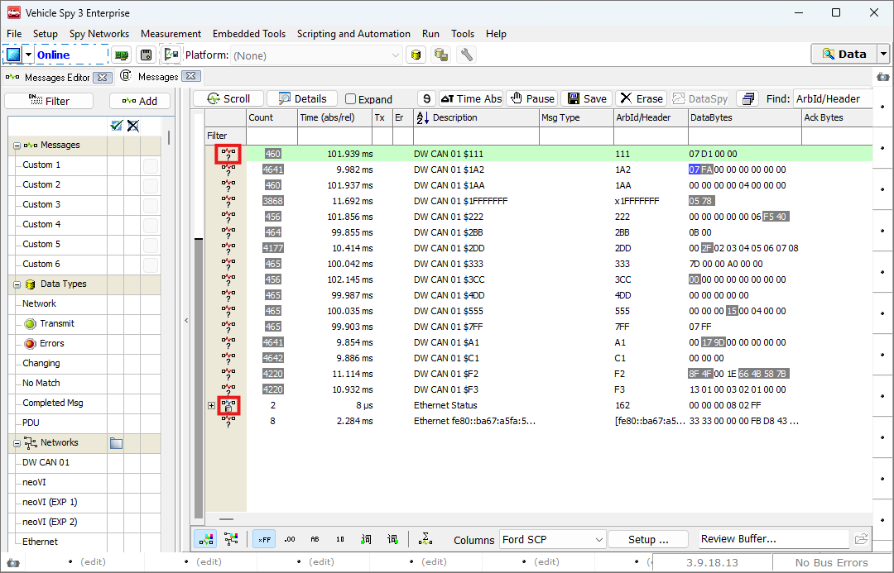

# 메시지 창

Messages View

## 들어가며..

이번 챕터에서는 Messages 창에서 장치로부터 들어오고 나가는 메시지를 모니터링하는 방법에 대해 알아보겠습니다.

## Messages 창

하드웨어 세팅을 마치고 neoVI Explorer 창을 닫으면 화면이 아래 그림과 같이 변하게 됩니다.

<figure>

<figcaption>Main Pages</figcaption>
</figure>

상단 메뉴에서 Spy Networks > Messages를 클릭하여 Messages 창을 열어줍니다.

<figure>

<figcaption>Messages 창: 상단 메뉴 설명</figcaption>
</figure>

창 상단에 보시면 Scroll 부터 DataSpy까지 다양한 버튼이 있는 것을 확인하실 수 있습니다 각 기능에 대한 설명은 다음과 같습니다.

- Scroll: 메시지를 들어오는 순서대로 정렬합니다. Scroll을 다시 눌러 원래의 화면으로 전환할 수 있습니다.
- Details: 메시지의 상세한 내용을 확인할 수 있습니다. 주로 Ethernet 패킷과 같이 Payload가 긴 메시지 보기 위해 사용됩니다.
- Expand: 이 체크박스를 클릭하면, 8바이트 이상의 메시지 값을 확인할 수 있습니다. 이를 통해 CAN FD와 같이 더 긴 메시지의 데이터를 자세히 살펴볼 수 있습니다.
- Time Abs: 해당 버튼을 누를때마다 Time 열에 표시되는 값을 이전 메시지 간의 주기와 온라인 상태 시작 이후 메시지가 들어오기까지의 절대 시간을 번갈아 표시합니다.
- Pause: Messages 창에 새로 업데이트되는 메시지의 표시를 일시 중단하는 기능입니다.  실제 메시지의 송수신에는 영향을 주지 않고 화면 갱신만 일시적으로 멈추게 됩니다.
- Save: 버퍼에 쌓인 메시지를 저장할 수 있는 버튼입니다. [데이터 로깅](/data-logging/) 챕터에서 상세기능을 확인할 수 있습니다.
- Erase: 버퍼에 쌓인 메시지 내용을 삭제합니다. 이 기능은 버퍼와 메시지 창 모두에 영 향을 미칩니다.
- DataSpy: 로그 데이터 후분석 툴인 Data Spy를 실행하는 버튼입니다. (Vehicle Spy Professional 이상, 3.9.14.15 이상에서만 사용할 수 있습니다.)
- New Form: 해당 버튼을 통해 새 창에서 Messages 창을 띄울 수 있습니다.

<figure>

")
<figcaption>Messages 창: 하단 메뉴 설명(1)</figcaption>
</figure>

다음은 하단 메뉴에 대해 설명드리겠습니다.

- xFF: Messages 창에표기되는 내용을 16진수(hex)로 보여줍니다.
- .00: Messages 창에표기되는 내용을 10진수(dec)로 보여줍니다.
- AB: Messages 창에표기되는 내용을 ASCII 코드로 보여줍니다.
- 10: Messages 창에표기되는 내용을 2진수(bin)로 보여줍니다.
- .词: Messages 창에표기되는 내용을 Unicode Big Endian으로 보여줍니다.
- 词.: Messages 창에표기되는 내용을 Unicode Little Endian으로 보여줍니다.
- Σ: 들어오는 메시지의 주기에 대한 통계 값을 표시합니다. 주기의 최소값, 최대값, 평균값, 표준편차, 처음으로 메시지가 들어온 시간, 그리고 메시지의 내용이 변한 횟수를 보여줍니 다.

<figure>

")
<figcaption>Messages 창: 하단 메뉴 설명(2)</figcaption>
</figure>

다음으로 설명드릴 기능은 메시지의 표시 색상을 변경할 수 있는 기능입니다.

Vehicle Spy 3에서는 Spy Networks > Networks 에서 네트워크 별 메시지 색상을Spy Networks > Messages Editor에서 메시지 별 색상을 지정할 수 있습니다.

좌측의  버튼은 Messages Editor에서 지정한 색상으로 보여주는 버튼이고 우측의  버튼은 Networks에서 지정한 색상으로 보여주는 버튼입니다.

<figure>

")
<figcaption>Messages 창: 하단 메뉴 설명(3)</figcaption>
</figure>

다음으로는 Columns 기능에 대해 설명드리겠습니다.

이 기능은 각 프로토콜의 특성에 맞게 화면에 표시되는 행의 순서와 내용을 자동으로 조정합니다. 기본적으로 CAN/CAN FD, 10BASE-T1S, Ethernet 등 다양한 프리셋을 제공 하며, 이를 통해 네트워크의 특성에 맞춘 최적화된 표시를 지원합니다.

또한, 우측에 위치한 Setup... 버튼을 클릭하여 프리셋을 추가, 수정, 삭제할 수 있어 사용자 맞춤형 설정이 가능합니다.

Setup... 버튼을 통해 설정 창을 열게되면 아래와 같은 화면이 표시됩니다.

<figure>

<figcaption>Scrolling Message History Setup: General</figcaption>
</figure>

General 탭의 Number Of Messages in History 설정을 통해 버퍼의 크기를 조정할 수 있습니다.

Vehicle Spy 3는 환형 버퍼(Ring Buffer) 방식을 사용하여 데이터를 저장합니다.

이 방식은 버퍼가 가득 차면 가장 오래된 데이터부터 삭제하고, 새로운 데이터를 덮어쓰는 방식으로 동작합니다. 버퍼의 최대 크기는 하드웨어의 성능에 따라 다르나 이론적으로 약 21 억(Integer의 최대 값)개 까지 설정이 가능합니다.

<figure>

<figcaption>Scrolling Message History Setup: Column Setup</figcaption>
</figure>

Column Setup 탭을 통해 Message 창에 표시되는 프리셋을 설정할 수 있습니다. 드롭다운 메뉴를 통해 편집하고자 하는 프리셋을 선택하거나, 좌측의 + 버튼을 이용하여 신규 프리셋을 생성합니다.

프리셋을 수정하기 위해서 Fields Available 탭에서 보고자 하는 항목을 순서대로 선택하여 우측의 Fields Selected탭에 추가합니다.

Fields Selected 탭에서 보여주고자 하는 항목의 순서를 편집합니다. 순서를 조정하고 싶은 메시지를 선택 후 하단의 ↑, ↓ 버튼을 통해 순서를 조정합니다.

불필요한 메시지는 - 버튼을 통해 제거할 수 있습니다.

<figure>

<figcaption>Scrolling Message History Setup: Custom Dissectors</figcaption>
</figure>

다음으로는 Custom Dissectors 탭을 통해 .lua 파일을 등록할 수 있습니다. 

Lua Dissectors(.lua) 파일은 Wireshark와 같은 네트워크 패킷 분석 도구에서  특정 프로토콜을 분석하는 데 사용되는 Lua 스크립트 파일입니다.

<figure>

<figcaption>Scrolling Message History Setup: Fonts and Colours</figcaption>
</figure>

마지막으로 Fonts and Colors 탭을 통해서 프로그램의 폰트와 크기, 색상 등을 변경할 수 있습니다.

모든 설정을 완료하였다면 Colse 버튼을 눌러 다시 Messages 창으로 돌아옵니다.

## Online (Run with Transmit)

<figure>

<figcaption>Messages 창: Run with Transmit</figcaption>
</figure>

실제 CAN 메시지를 보는 방법과 해당 화면의 기본적인 기능을 설명드리겠습니다. 왼쪽 상단 Offline 옆에 있는 드롭다운 메뉴에서 Run with Transmit을 클릭하면 실시간으로 값을 확인할 수 있는 상태 (Online)가 됩니다.

이 때 아래와 같은 경고 창이 뜰 수 있는데, 이는 장비에 세팅한 Baud Rate와 기존 Vehicle Spy 3에서 사용하는 Baud Rate이 달라서 발생하는 문제로 장비의 Baud Rate을 알맞게 설정하셨다면 ([하드웨어 설정](../hardware-settings/) 참고) 아래 화면과 같이 Use Hardware Baud Rates를 눌러줍니다.

<figure>

<figcaption>Error: Baud Rates</figcaption>
</figure>

설정을 모두 완료하신 후 Spy Networks > Messages로 이동하면 아래 그림과 같이 현재 들어오는 메시지들이 화면 중앙에 표시되는 것을 확인할 수 있습니다.

<figure>

")
<figcaption>Messages 창: Run with Transmit(Online)</figcaption>
</figure>

화면 좌측 하단의 하얀색 바에 회색 막대가 차는 모습을 볼 수 있는데, 이는 이전에 설정한 버퍼 크기를 나타냅니다. 흰색 부분은 빈 공간, 회색 부분은 데이터가 저장된 공간을, 검은 색 부분은 현재 데이터가 쓰여지는 공간을 나타냅니다. 버퍼가 모두 차면 처음으로 돌아가 가장 오래된 데이터를 덮어쓰는 방식으로 동작합니다.

화면 중앙에는 현재 들어오는 모든 메시지가 표시됩니다. CAN/CAN FD를 기준으로 각 행 에 대한 설명은 다음과 같습니다.

- Count: 온라인 상태부터 메시지가 들어온 횟수를 나타냅니다.
- Time: 이전 메시지로부터의 주기를 나타냅니다.
- Tx, Er: 각각 메시지를 송신중일 때, 에러 발생시   아이콘이 표시됩니다.
- Description: 메시지가 들어오는 네트워크 이름과 ID를 나타냅니다.
- ArbId/Header: CAN 메시지의 Arbitration ID 값을 보여줍니다. Len: Data
- Payload의 크기를 나타냅니다. (DLC 값)
- DataBytes: 메시지의 Data 내용을 보여줍니다.
- Network: 해당 메시지가 들어온 네트워크를 보여줍니다.
- ChangeCnt: 메시지의 내용이 바뀐 횟수를 표시합니다. 
새로 들어온 메시지가 직전에 들어온 메시지와 동일한 경우 증가하지 
- 않습니다.
- Timestamp: 해당 메시지가 들어온 절대 시간을 보여줍니다.

Messages 창의 글자 바탕색은 내용이 들어오는 주기에 따라 달라집니다. 1초 이내에 변경된 값이 들어오면 회색, 1~5초 이내에 변경되면 파랑색, 변경이 없을 경우 흰색으로 표시됩니다.

<figure>

<figcaption>Messages</figcaption>
</figure>

화면에 보시면 일부는 ? 아이콘이, 일부는 DB 아이콘이 표시되는 것을 확인할 수 있습니다. 이는 해당 메시지가 데이터베이스 파일에 등록되었는지 여부에 따라 다릅니다. DB 아이콘은 이미 등록된 메시지를 의미하며, ? 아이콘은 등록되지 않은 메시지를 나타냅니다.

신호가 의미하는 바를 정확하게 이해하려면 메시지를 해독(decode)할 수 있어야 하는데, 이때 사용하는 것이 데이터베이스 파일입니다.

다음 챕터에서 데이터베이스 파일과 플랫폼에 대해 자세히 알아보겠습니다.