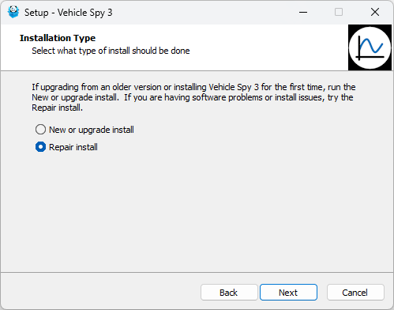
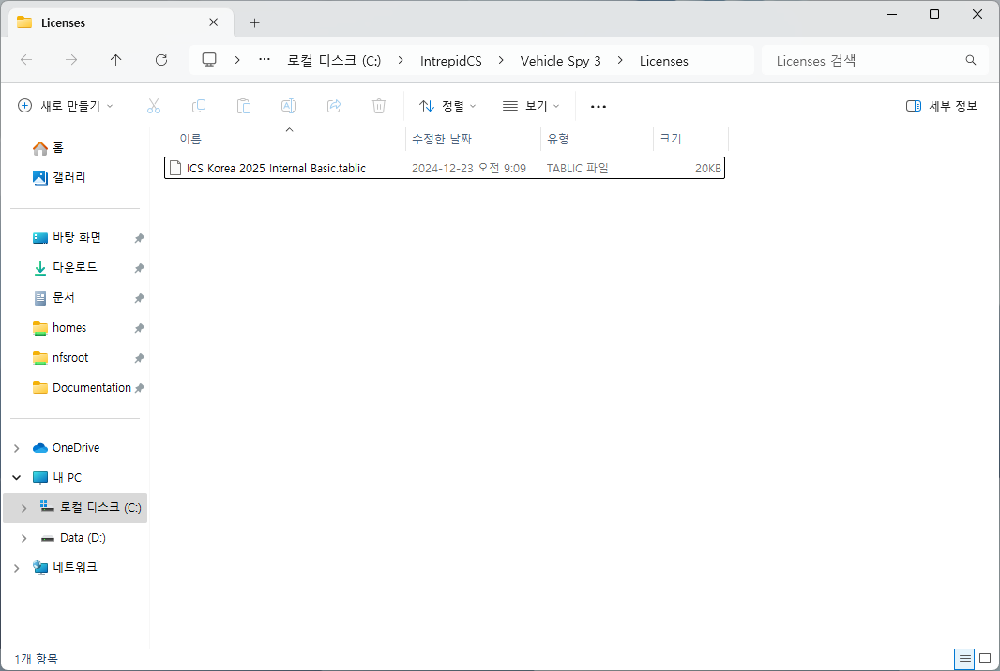

# Vehicle Spy3 소프트웨어 설치

### 들어가며..

* 이 페이지에서는 Vehicle Spy 3의 설치 방법을 안내합니다.
* 이미 Vehicle Spy 3가 설치되어 있다면, [다음 챕터](/getting-started/)로 넘어가 주시기 바랍니다.

### 설치 파일 다운로드 및 압축 해제

* 제품 구매 시, USB 또는 이메일을 통해 설치 링크와 라이센스 파일이 제공됩니다.
* 제공된 링크를 통해 설치 파일을 다운로드 받습니다.
* 제공된 암호를 사용하여 다운로드한  zip파일의 압축을 해제합니다.

<figure>

<figcaption>Download the Installation Files</figcaption>
</figure>

### 설치 파일 실행

* vspy3\_install.exe 파일을 마우스 오른쪽 버튼을 누른 후 관리자 권한으로 실행합니다.\
  (관리자 권한으로 실행하지 않을 경우, 설치 후 예기치 않은 문제가 발생할 수 있습니다.)
* 설치 프로그램의 안내대로 설치를 진행합니다. \
  Installation Type을 물어보는 선택창에서 기존에 Vehicle Spy 3가 설치된 PC에서 재설치하는 경우 **Repair install**을 신규 설치인 경우에는 **New or upgrade install**을 선택합니다.
* Repair Install 방식으로 설치하는 과정에서 마지막 단계인 WinPCAP 설치 시 에러가 발생하면, ‘무시’를 클릭하여 설치를 계속 진행하시면됩니다.

<figure>

<figcaption>Installation</figcaption>
</figure>

### 라이센스 파일 등록

* 소프트웨어 설치 후, 동봉된 라이선스 파일을 아래 경로에 넣어줍니다.

> C:\IntrepidCS\Vehicle Spy 3\Licenses

<figure>

<figcaption>C:\IntrepidCS\Vehicle Spy 3\Licenses</figcaption>
</figure>

라이센스나 설치 관련 문의 사항이 있으시다면 [기술 지원](/support)팀에 연락주시기 바랍니다.
