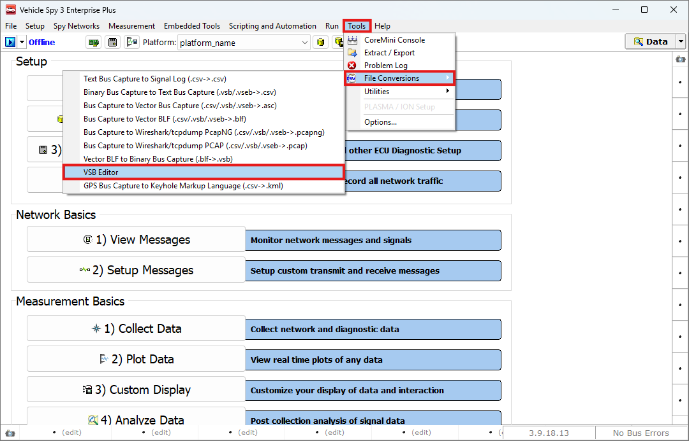
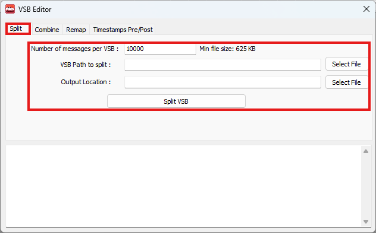
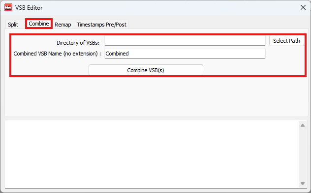
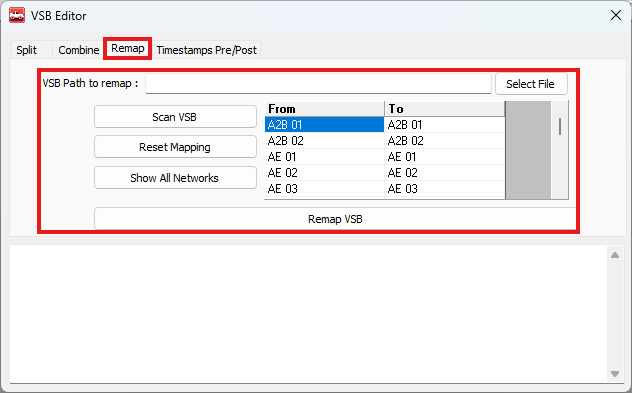
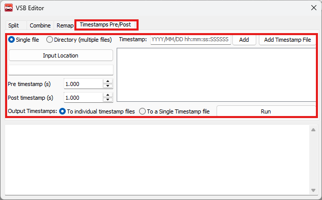

# Logging 데이터 통합/분할/맵핑 (VSB Editor)

### 들어가며..

Vehicle Spy 3를 통해 로깅한 파일(.vsb)의 데이터 용량이 큰 경우, 분석하는데 불편함을 초래할 수 있습니다. 반대로, 데이터가 여러 파일로 분산되어 있는 경우에도 분석하는데 용이하지 않습니다. 이런 경우, Vehicle Spy 3의 VSB Editor를 이용해 로그 파일을 병합하고 분할 할 수 있습니다. 이번 챕터에서는 VSB Editor를 사용하여 로깅된 데이터를 편집하는 방법에 대해 알아보겠습니다.

### VSB Editor

아래 그림과 같이Tools >  File Conversions > VSB Editor를 클릭하여 VSB Editor를 실행합니다.

<figure>

<figcaption>Tools > File Conversions > VSB Editor</figcaption>
</figure>

#### VSB Editor: Split

Split 탭은 하나의 큰 vsb 파일을 일정한 크기로 분할하여 여러 개의 vsb 파일을 생성하는 기능입니다.

<figure>

<figcaption>VSB Editor: Split</figcaption>
</figure>

각 항목에 대한 설명은 다음과 같습니다.

* Number of messages per VSB: 각 파일에 포함될 메시지 개수를 입력합니다. 우측에는 해당 메시지 수 기준으로 계산된 파일 크기 예상치가 표시됩니다.
* VSB Path to split: 분할할 원본 .vsb 파일의 경로를 지정합니다. Select File 버튼을 클릭하거나, 텍스트 필드에 직접 경로를 입력할 수 있습니다.
* Output Location: 분할된 VSB 파일을 저장할 위치를 지정합니다.

모든 설정을 마친 후 Split VSB 버튼을 클릭하면 분할이 진행됩니다.

#### VSB Editor: Combine

Combine 탭은 여러 개의 vsb 파일을 하나의 파일로 병합할 수 있는 기능입니다.

<figure>

<figcaption>VSB Editor: Combine</figcaption>
</figure>

각 항목에 대한 설명은 다음과 같습니다.

* Directory of VSBs: 병합할 vsb 파일들이 들어 있는 폴더 경로를 입력합니다. 해당 디렉토리의 모든 .vsb 파일이 자동으로 병합됩니다.
* Combined VSB Name (no extension): 새로 생성할 vsb 파일의 이름을 입력합니다. (파일 확장자는 자동으로 추가되니, 이 필드에는 입력하지 않습니다.)

모든 설정을 마치고 Combine VSB(s) 버튼을 누르면 파일이 병합됩니다.

#### VSB Editor: Remap

Remap 탭은 vsb 파일의 네트워크 할당을 다른 네트워크로 변경하는 기능입니다.

예를 들어 특정 채널에서 들어온 메시지 데이터를 다른 네트워크로 재설정하여 분석 목적에 맞게 사용하실 수 있습니다.

<figure>

<figcaption>VSB Editor: Remap</figcaption>
</figure>

네트워크 매핑 변경 절차는 다음과 같습니다.

1. VSB Path to remap: 네트워크를변경할 vsb 파일의 경로를 입력합니다.  Select File 버튼을 클릭하거나, 텍스트 필드에 직접 경로를 입력할 수 있습니다.
2. Scan VSB 버튼을 눌러 vsb 파일에서 사용되는 네트워크를 모두 검색합니다.
3. To 열을 원하는 네트워크로 변경합니다.
4. Reset Mapping 버튼을 통해 원래 상태로 불러올 수 있습니다.

모든 설정을 마치고 Remap VSB 버튼을 눌러 vsb 파일의 네트워크를 변경한 새로운 파일을 생성합니다.

#### VSB Editor: Timestamps Pre/Post

Timestamps Pre/Post 탭은 특정 트리거 시점을 기준으로 앞 뒤 데이터를 잘라내는 트리밍 기능입니다.

이 기능은 에러 발생 시점이나 특정 이벤트 전후의 데이터만을 따로 분석하고자 할 때 유용하게 사용하실 수 있습니다.

<figure>

<figcaption>VSB Editor: Timestamps Pre/Post</figcaption>
</figure>

좌 상단의 Radio button을 통해 Single file 혹은 Directory 중 하나를 선택할 수 있습니다.

Input Location 버튼을 통해 해당 vsb 파일 혹은 파일들이 위치한 디렉토리를 선택해줍니다.

Timestamp: 해당 필드에 YYYY/MM/DD hh:mm:ss:SSSSS 형식으로 기준이 될 시점을 입력합니다. 하나 이상의 timestamp를 입력하실 수 있습니다. 또는 Add Timestamp File 버튼을 통해 타임스탬프가 포함된 외부 파일을 불러올 수도 있습니다.

Pre timestamp, Post timestamp는 해당 시점을 기준으로 앞 뒤로 나눌 시간을 설정합니다.

Output Timestamps 옵션을 통해 추출된 데이터의 저장 방식을 선택합니다.

* To individual timestamp files는 각 타임스탬프마다 별도의 vsb 파일이 생성됩니다.
* To a single Timestamp file은 각 타임스탬프의 결과를 하나의 파일로 병합하여 저장합니다.

모든 설정을 마치고 Run 버튼을 눌러 파일을 생성합니다.

이상으로 VSB Editor의 사용방법을 알아보았습니다.
