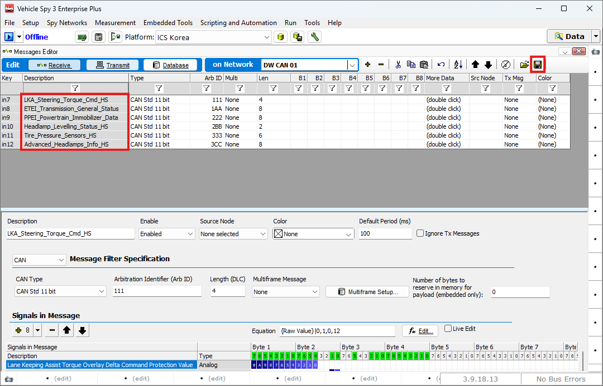
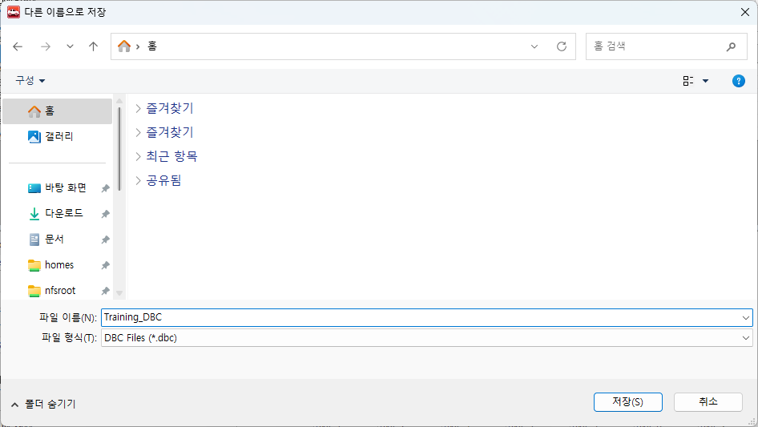

# DBC 파일 생성하기

### 들어가며..

앞서 생성한 수신 메시지를 다른 컴퓨터나 다른 프로그램에서 사용하려면 데이터베이스(DB) 파일이 필요합니다. CAN 메시지의 경우, DBC 포맷이 업계 표준으로 가장 널리 사용됩니다.

이번 장에서는, 앞서 작성한 수신 메시지나 송신 메시지를 다른 PC에서도 손쉽게 활용할 수 있도록 DBC 파일로 내보내는 방법을 알아보겠습니다.

### Messages Editor

아래 그림과 같이 Spy Networks > Messages Editor로 이동합니다.

<figure>

<figcaption>Spy Networks > Messages Editor</figcaption>
</figure>

아래 그림과 같이 저장을 원하는 메시지를 생성한 후 우측  버튼을 누릅니다. 메시지를 생성하는 방법은 여기를 참고해주십시오

<figure>

<figcaption></figcaption>
</figure>

### DBC 파일 저장

저장 버튼을 클릭하면 다른 이름으로 저장 창이 나타납니다. 이 창에서 파일 이름을 입력하고 저장 위치를 선택한 뒤, 저장 버튼을 클릭하면 DBC 파일이 저장됩니다.

<figure>

<figcaption>Spy Networks > Messages Editor: Save the DBC File</figcaption>
</figure>

