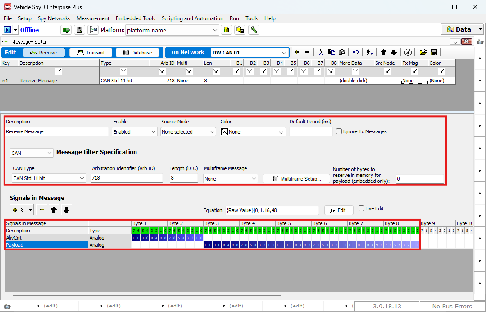
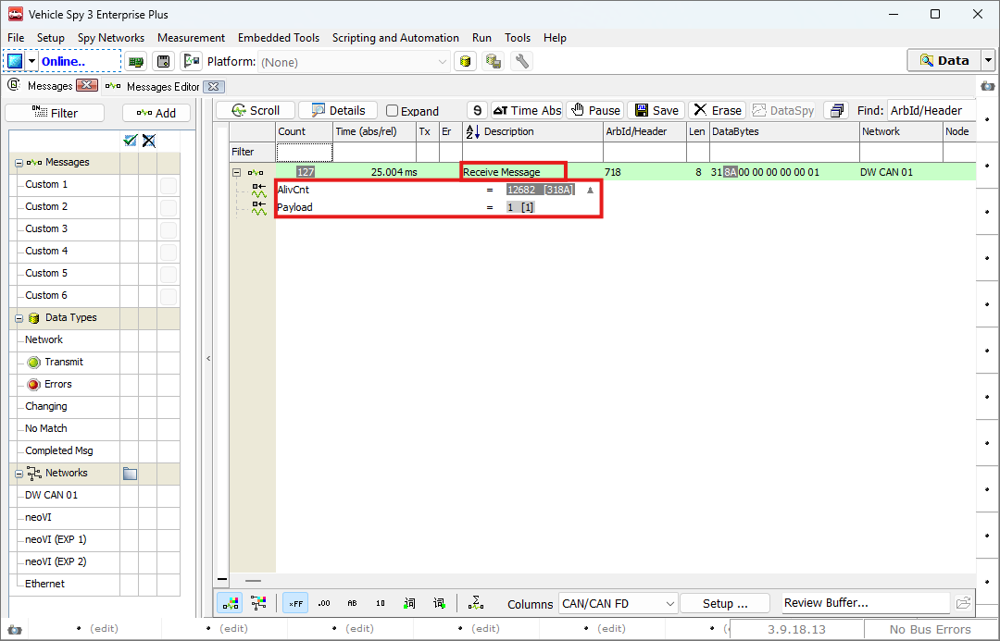
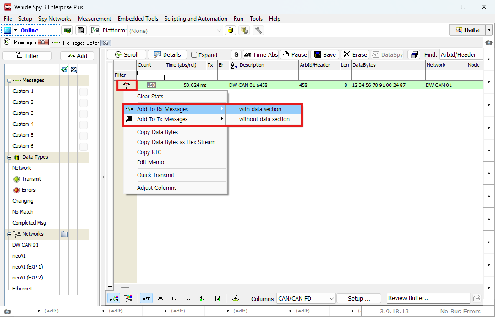
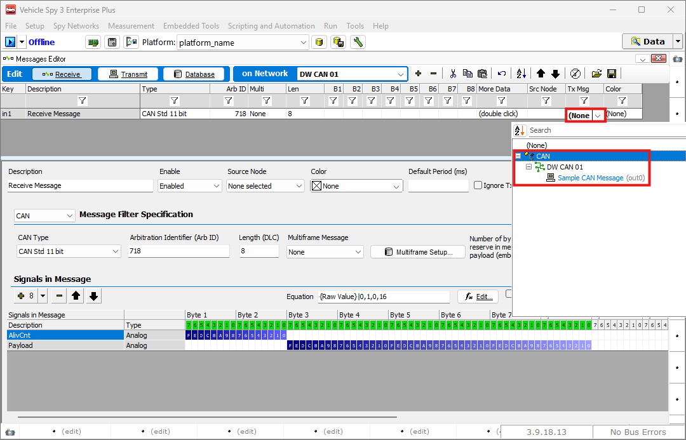
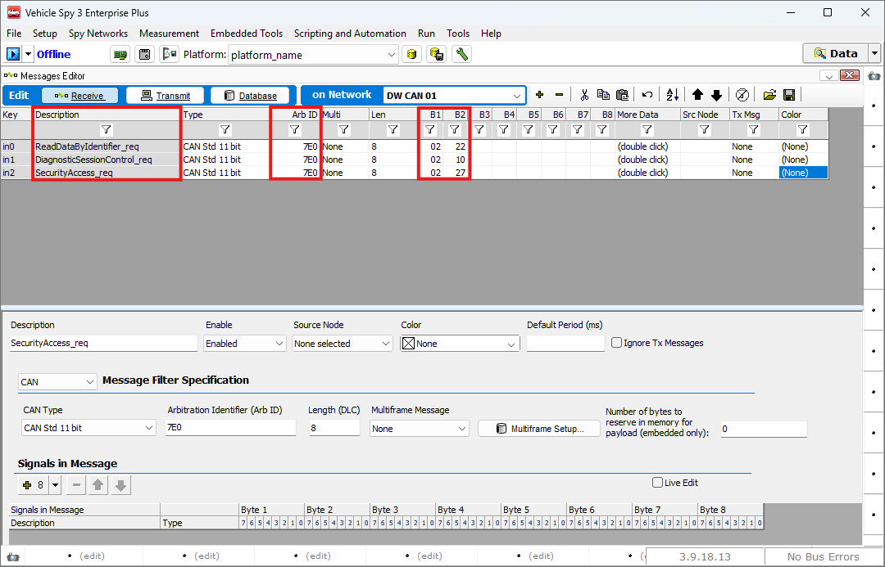

# 수신 메세지 생성하기

### 들어가며..

이번 장에서는 수신 메시지를 생성하고 정의된 메시지를DBC 파일로 만드는 방법에 대해 알아보겠습니다. 수신 메시지를 정의하는 이유는 Online 상태에서 특정 메시지가 들어왔을 때 디코딩을 해서 보기 위함이다..

### 수신 메세지 생성

수신 메시지를 생성하는 방법은 [송신 메시지를 생성하는 방법](./../generating-outgoing-messages/)과 동일합니다. 이번 내용에서는 수신 메시지를 생성하는 두 가지 방법과 특정 메시지가 수신되었을 때, 다른 어떤 메시지를 송신하는 방법에 대해 알아보겠습니다.

아래 그림과 같이 Spy Networks > Messages Editor로 이동합니다.

<figure>

<figcaption>Spy Networks > Messages Editor</figcaption>
</figure>

아래 그림과 같이 임의의 수신 메시지를 하나 생성하였습니다.

메시지와 시그널을 생성하는 방법은 송신 메시지를 생성하기 페이지를 참조해주시기 바랍니다.

<figure>

<figcaption>Messages Editor: Define a Receive Message</figcaption>
</figure>

### 메시지 수신 시 자동 송신

특정 메시지를 수신했을 때, 자동으로 다른 메시지를 송신하도록 설정할 수 있습니다. 설정 방법은 다음과 같습니다.

아래 그림과 같이 정의된 Receive 메시지의Tx Msg 탭을 더블 클릭하여 송신을 원하는 메시지를 선택합니다.

이렇게 설정하면, 지정한 메시지가 수신 될때마다 선택한 메시지가 자동으로 송신됩니다.

예를 들어, 특정 진단 요청 메시지가 들어오면, 미리 준비해둔 응답 메시지를 자동으로 보내는 식으로 활용할 수 있습니다.

<figure>

<figcaption>Messages View: Message Decoding</figcaption>
</figure>

들어온 메시지를 바로 수신 또는 송신 메시지로 설정하는 방법도 제공하고 있습니다. 

Messages View 탭에서 들어오는 메시지에 아래와 같이	아이콘을 클릭하고 Add To Rx Messages 또는 Add To Tx Messages를 선택 후 with data section, without data section 옵션을 선택하여 추가할 수 있습니다. With data section의 경우 메시지의 payload 까지 모두 정의되며, without data section 옵션의 경우 Arb ID Length 등만 메시지에 정의됩니다.

<figure>

<figcaption>Setup a new Message via Messages View</figcaption>
</figure>

위의 메시지가 with data section, 아래가 without data section입니다.

<figure>

")
<figcaption></figcaption>
</figure>

### 메시지 수신 시 자동 송신

특정 메시지를 수신했을 때, 자동으로 다른 메시지를 송신하도록 설정할 수 있습니다. 설정 방법은 다음과 같습니다.

아래 그림과 같이 정의된 Receive 메시지의Tx Msg 탭을 더블 클릭하여 송신을 원하는 메시지를 선택합니다.

이렇게 설정하면, 해당 메시지가 수신 될때마다 선택한 메시지가 자동으로 송신됩니다.

예를 들어, 특정 진단 요청 메시지가 들어오면, 미리 준비해둔 응답 메시지를 자동으로 보 내는 방식으로 활용할 수 있습니다.

<figure>

<figcaption>Set up auto transmission on receive.</figcaption>
</figure>

### 하나의 Source에서 오는 메시지를 구분하여 디코딩 하는 방법

진단통신이나 특정 프로토콜에서는 하나의 Source(IP, Arb ID)에서 여러 메시지가 올 수 있습니다. 이럴때는 Data payload의 특정 바이트 값을 사용하여 메시지를 구분해서 디코딩해야 합니다.

아래 그림처럼 동일한 Arb ID를 갖는 메시지를 생성 합니 다. 우측의 Data Payload 부분의 데이터를 원하는 내용으로 변경합니다. 이렇게 되면 Arb ID와 Data Payload의 

데 이터 값도 같아야 해당 메시지로 디코딩 됩니다.

<figure>

<figcaption>Set Multiple Message from a single source</figcaption>
</figure>

