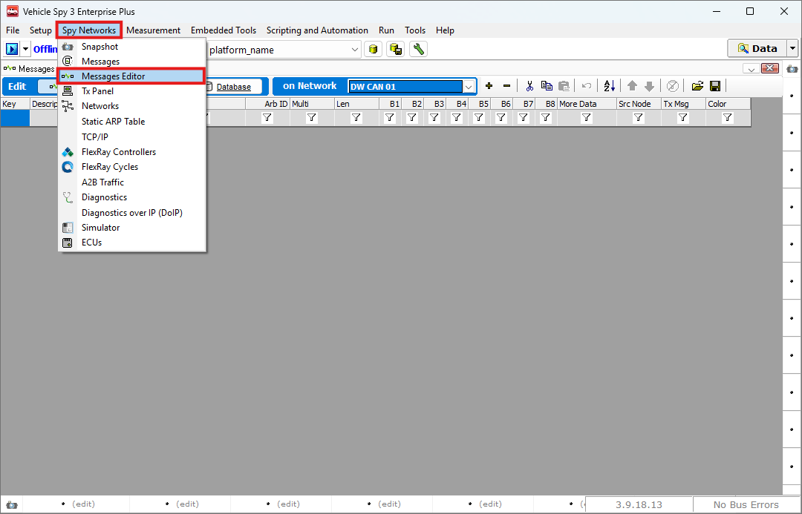
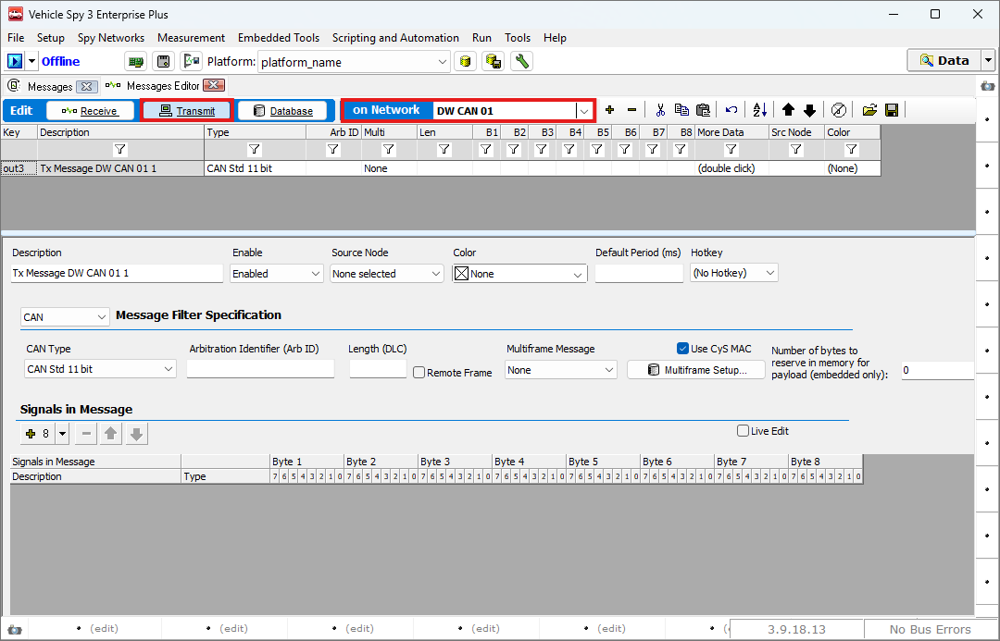
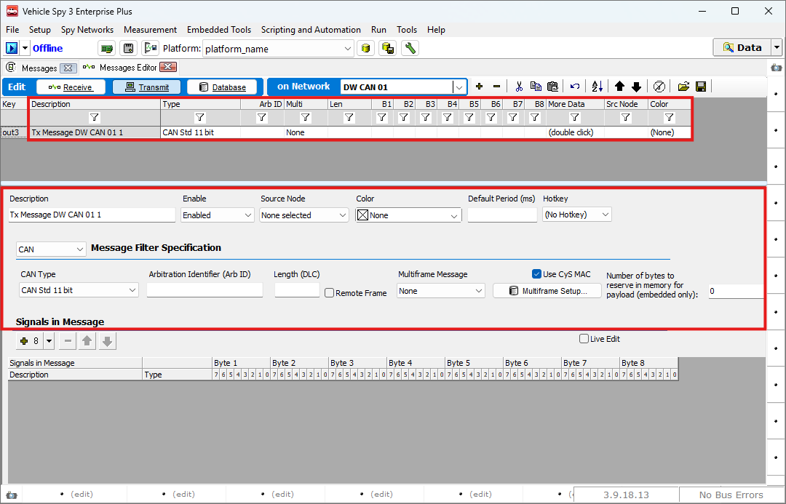

# 송신 메세지 생성하기

### 들어가며..

이번 장에서는 임의의 메시지를 만들어 송신하는 방법을 소개합니다.

### Messages Editor

아래 그림과 같이 Spy Networks > Messages Editor로 이동합니다.

<figure>

<figcaption>Messages Editor</figcaption>
</figure>

### 메시지 생성하기

아래 그림과 같이 Transmit 탭으로 이동 후 메시지를 보내기 원하는 네트워크를 선택해줍니다. 예시로 CAN 1번 채널의 메시지를 생성해보겠습니다.

<figure>

<figcaption>Messages Editor: Select Networks</figcaption>
</figure>

Network 옆의 + 버튼 혹은 Ctrl + Insert 버튼을 눌러 새로운 메시지를 생성하면 화면이 아래와 같이 바뀝니다. \
상단 또는 하단의 입력 영역을 통해 메시지를 정의할 수 있습니다.

<figure>

<figcaption>Messages Editor: Create new messages</figcaption>
</figure>

각 필드에 대한 설명은 다음과 같습니다.

* Description: Messages View 화면에 표시될 메시지의 이름입니다.
* Type: 메시지의 타입을 선택합니다. CAN/FD Std/Extended 옵션 중 하나를 선택할 수 있습니다.
* Arb ID: 메시지의 Arbitration ID 를 나타냅니다.
* Multi: Multiframe Message를 설정합니다. ISO 15765-2와 J1939 메시지를 지원합니다.
* Len: 메시지의 Payload 크기를 설정할 수 있습니다.
* Hotkey: 키보드 단축키를 지정하여, 온라인 상태에서 해당 키를 누르면 메시지를 전송할 수 있습니다.
* B1 \~ More Data: Payload의 값을 설정합니다.
* Src Node: 메시지의 소스 노드를 설정합니다.
* Color: Messages View에 표시될 폰트 색상을 선택할 수 있습니다.

하단에 입력 영역에는 추가로 아래와 같은 설정을 할 수 있습니다.

* Use CyS MAC: ??
* Remote Frame: 리모트 프레임을 설정합니다. 수신 노드로부터 응답 데이터를 요청하는데 사용됩니다.

### 시그널 생성하기

메시지 정의가 완료되었다면 메시지의 들어갈 시그널을 정의해줍니다. 아래 그림과 같이 + 버튼을 눌러 새로운 시그널을 생성해줍니다.

<figure>

<figcaption>Messages Editor: Create new Signals</figcaption>
</figure>

메시지를 더블 클릭하거나  버튼을 클릭하면 아래와 같은 시그널 설정 창이 열립니다.
상단의 Signal Type과 Raw Value Type을 통해 시그널의 속성성을 선택할 수 있습니다.

<figure>

")
<figcaption>Messages Editor: Edit Signals(1)</figcaption>
</figure>

각 Signal Type에 대한 설명은 다음과 같습니다:

* Analog:  RPM, Tempeeature, Speed 등 연속적인 숫자를 나타내는 데 적합합니다.
* Digital: Switch, Active information 등 이진정보(true/false, on/off)를 나타내는데 적합합니다.
* State Encoded: 기어 단수(P, R, N, D), 파워 모드 등 특정 값이 의미 있는 텍스트 상태와 매칭되는 정보를 나타내는데 적합합니다.
* Text: VIN 등 Text 정보를 나타내는데 사용합니다. ASCII나 UTF-16을 통해 문자를 변환합니다.
* DTC(Diagnostic Truble Code): ECU의 고장 코드를 나타내는데 적합합니다.
* Table Lookup: Lookup table을 만들 수 있습니다.

Raw Value Type은 시그널 데이터를 어떤 형식으로 해석할지를 설정하는 항목입니다.

* Unsigned Integer: 시그널을 부호 없는 정수형으로 해석합니다.
* Signed 2's Complement Integer: 시그널을 부호 있는 2의 보수법으로 해석합니다.
* Signed Sign/Magnitude Integer: 시그널을 부호/크기 방식의 정수형으로 해석합니다.
* 32 Bit IEEE Float: 시그널을 32비트 부동 소수점 수로 해석합니다.
* 64 Bit IEEE Float: 시그널을 64비트 부동 소수점 수로 해석합니다.
* Packed BCD: 시그널을 Packed Binary Coded Decimal 방식으로 해석합니다.
* Tasking Float: 시그널을 Tasking 부동 소수점 방식으로 해석합니다.

다음은 General 탭입니다.

<figure>

")
<figcaption>Messages Editor: Edit Signals(2)</figcaption>
</figure>

각 메뉴의 내용은 다음과 같습니다.

* Start: 시작 비트 정보를 설정합니다. 비트 혹은 바이트 단위로 설정할 수 있습니다.
* Length: 메시지의 길이를 설정합니다. 비트 혹은 바이트 단위로 설정할 수 있습니다.
* Big End First: 해당 라디오버튼을 선택하면 메시지를 빅엔디언 방식으로 설정합니다.
* Little End First: 해당 라디오버튼을 선택하면 메시지를 리틀엔디언 방식으로 설정합니다.

다음으로 Scaling 탭에서는 다음과 같습니다.

<figure>

")
<figcaption>Messages Editor: Edit Signals(3)</figcaption>
</figure>

* Scaling Type: Scaling Type을 선택합니다. Linear mX + b 또는 Custom 중 하나를 선택하실 수 있습니다.
* 하단의 m, b 값으로 스케일링 할 수 있습니다.

다음으로 Advanced 탭에서는 다음과 같습니다.

<figure>

")
<figcaption>Messages Editor: Edit Signals(4)</figcaption>
</figure>

* Multiplexer:
* Enable J1939 and Not Available states: 모든 비트가 1인 시그널의 경우 Not Available, 모든 비트가 1이고 마지막 비트만 0인 경우 Invalid 신호를 나타냅니다.
* Use sequential (0-N) bit counting for Intel signals (J1939 style): 데이터를 바이트 순서대로 읽으며, 비트 번호를 0부터 순차적으로(J1939 방식) 부여하여 해석합니다.

마지막으로 ECU 탭은 다음과 같습니다.

<figure>

")
<figcaption>Messages Editor: Edit Signals(5)</figcaption>
</figure>

* Format: 데이터 표시 형식을 설정합니다.
* Min: Scaling, Value Type에 따라 결정되는 시그널의 최소값입니다.
* Max: Scaling, Value Type에 따라 결정되는 시그널의 최대값입니다.
* Units: 단위를 설정할 수 있습니다.

세팅을 모두 마치면 OK 버튼을 눌러 Messages Editor 탭으로 돌아갑니다. 

다음 장에서는 생성한 메시지를 송신하는 방법에 대해 알아보겠습니다.
