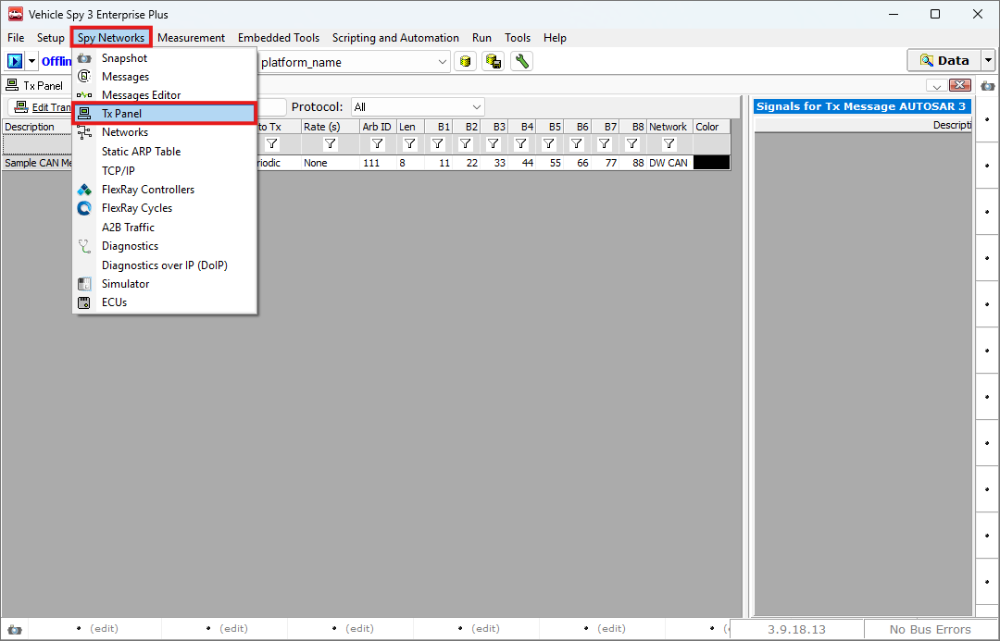
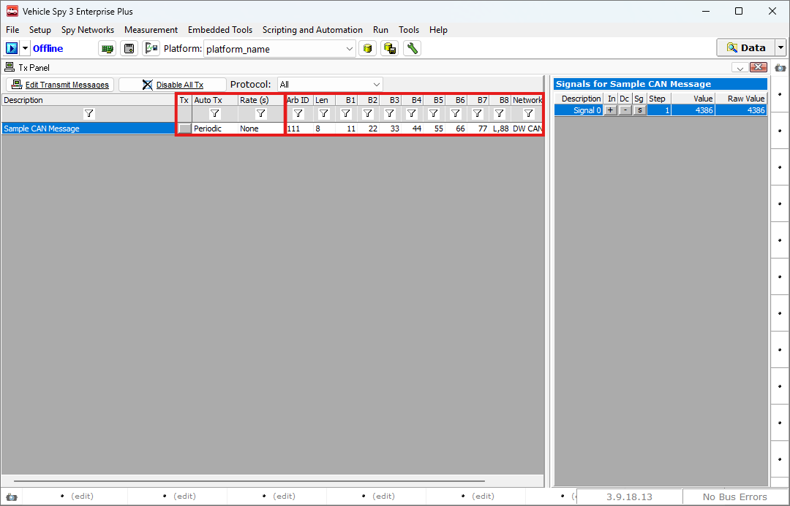
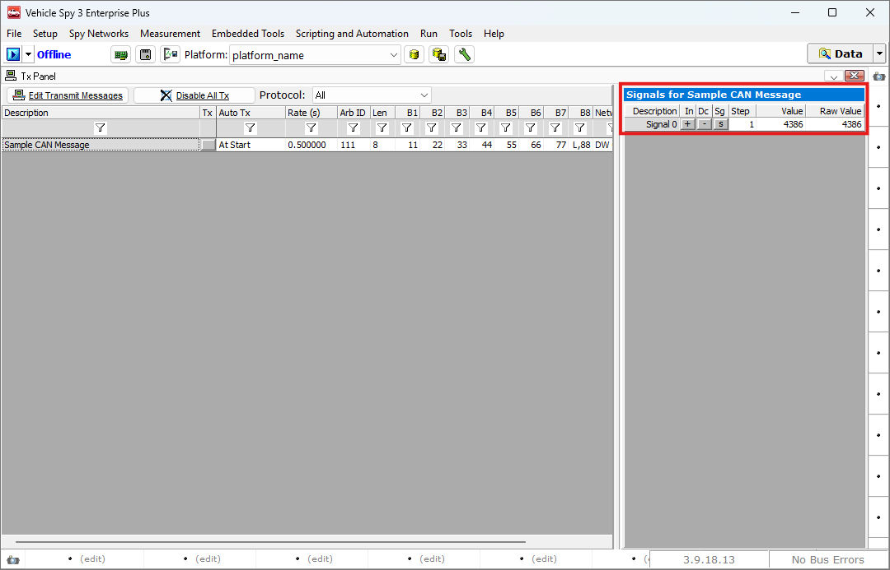
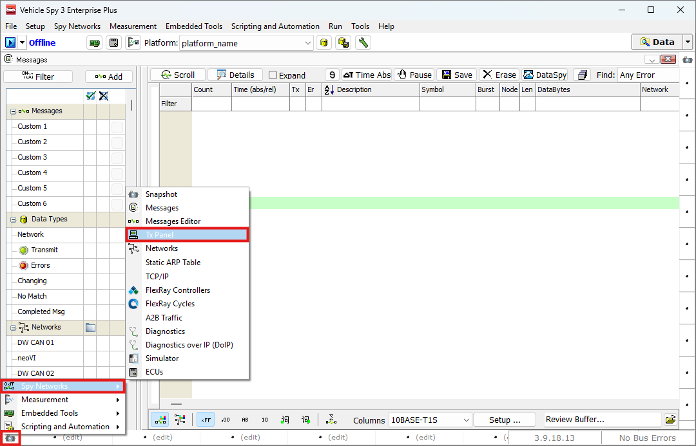
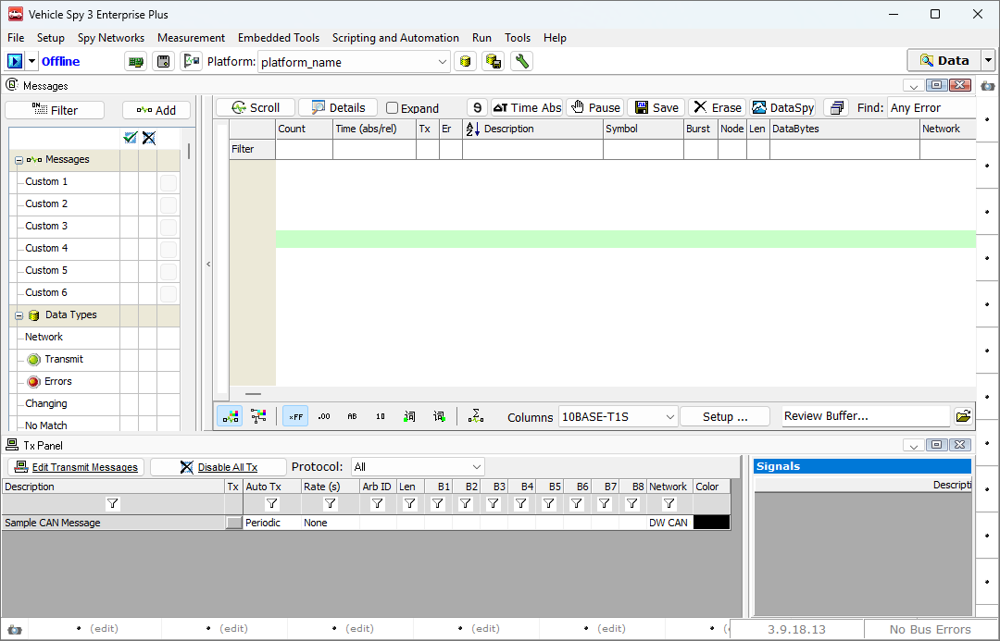

# 메시지 송신하기

### 들어가며..

이번 장에서는 생성한 메시지를 송신하는 방법에 대해 알아보겠습니다.

### Tx Panel

아래 그림과 같이 Spy Networks > Tx Panel로 이동합니다.

<figure>

<figcaption>Spy Networks > Tx Panel</figcaption>
</figure>

Tx Panel에서는 Messages Editor의 Transmit 탭에 있는 모든 메시지가 표시됩니다.

<figure>

<figcaption>Tx Panel Edit Message</figcaption>
</figure>

* Tx: 이 버튼을 누르면 해당 메시지를 1회 송신합니다.
* Auto Tx: 메시지를 주기적으로 송신할 수 있습니다.
  * Periodic: Online 시 설정된 주기(Rate)대로 메시지를 보냅니다. 주기가 None 혹은 0인 경우 버튼을 클릭하였을 때 1회 메시지를 송신합니다.
  * At Start: Online 시 한 번만 메시지를 보냅니다.
  * Periodic On/Off: 설정한 주기대로 메시지를 보내는 기능을 Tx 버튼을 눌러 켜고 끌 수 있습니다.
* Rate (s): 메시지의 주기를 설정할 수 있습니다.

이 외에도 메시지를 선택하면 우측의 필드를 통해 송신할 메시지 시그널의 편집이 가능합니다.

<figure>

<figcaption>Tx Panel: Edit Signal Values</figcaption>
</figure>

* In: + 버튼을 눌러 시그널의 값을 Step 만큼 증가시킵니다.
* Dc: - 버튼을 눌러 시그널의 값을 Step 만큼 감소시킵니다.
* Sg: 시그널의 값을 동적으로 변화시킬 수 있습니다.
  * None: 값 변화 없음
  * Random: 랜덤 값으로 시그널의 값을 업데이트 합니다.
  * Sine wave: 사인 파형으로 시그널의 값을 업데이트 합니다.
  * Ramp: 램프 파형으로 시그널의 값을 업데이트 합니다.
  * Square wave: 직각파형으로 시그널의 값을 업데이트 합니다.
  * Triangle: 삼각파형으로 시그널의 값을 업데이트 합니다.
  * Edit...: 사용자 지정 시나리오로 시그널의 값을 업데이트 합니다.
* Step: Inc, Dec 버튼을 눌렀을때의 증가 폭을 설정합니다.
* Value: Scaling 값이 적용된 값을 표시합니다.
* Raw Value: Scaling 값이 적용되기 이전의 값을 표시합니다.

Value 혹은 Raw Value 값을 더블클릭하여 직접 수정하는 것도 가능합니다.

추가로 Messages View와 Tx Panel을 동시에 사용하는 방법을 설명드리겠습니다.

우선  열려있는 Tx Panel을 우측 상단의 X 버튼을 이용해 닫습니다.

아래 그림과 같이 Messages View 창을 띄운 후, 좌측 하단의 Alternative Workspace 버튼을 눌러 Spy Networks > Tx Panel 버튼을 눌러줍니다.

<figure>

<figcaption>Alternative Workspace</figcaption>
</figure>

이제, 아래와 같이 Messages View와 Tx Panel을 함께 사용하실 수 있습니다.

<figure>

<figcaption>Tx Panel With Messages View</figcaption>
</figure>

