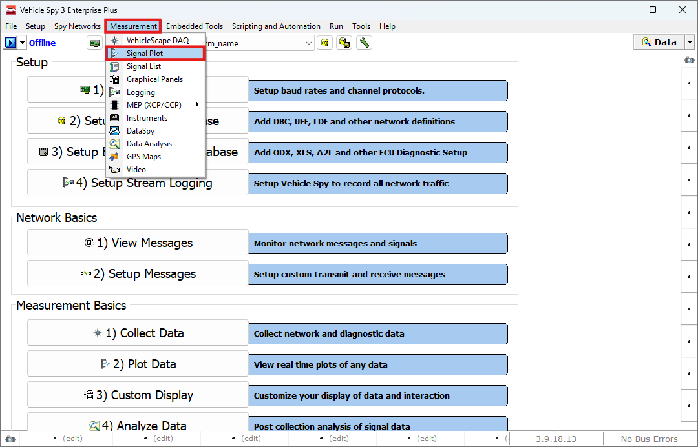
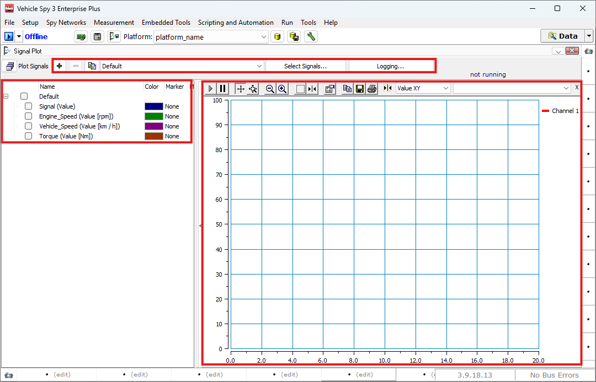
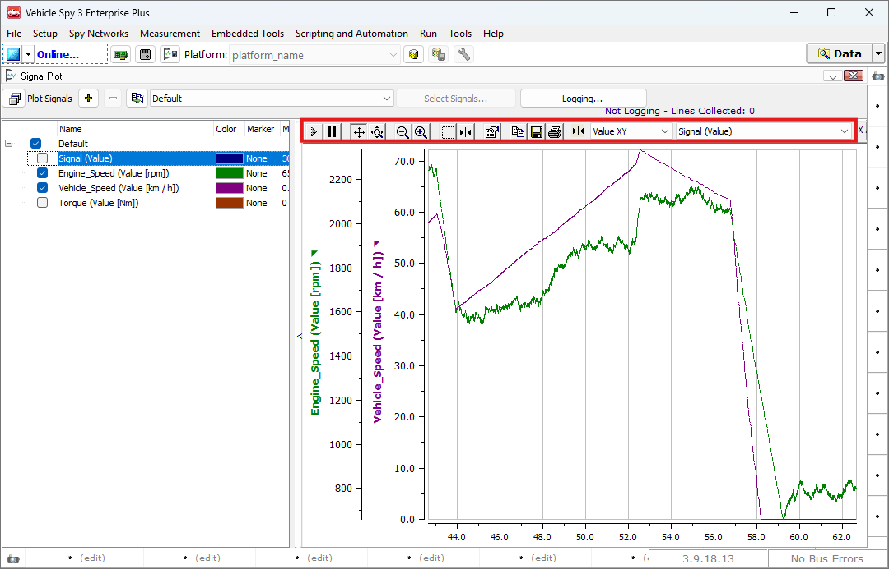
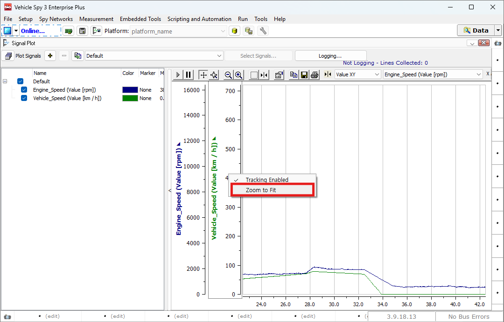

# 실시간 신호 그래프 보기

### 들어가며..

이번 챕터에서는 실시간으로 업데이트되는 신호값들을 그래프로 볼 수 있는 방법에 대해 소개합니다.&#x20;

### Signal Plot

아래 그림과 같이 Measurement > Signal Plot으로 이동합니다.

<figure>

<figcaption>Measurement > Signal Plot</figcaption>
</figure>

Signal Plot 창은 아래 그림과 같습니다.

<figure>

<figcaption>Signal Plot: Overview</figcaption>
</figure>

이전 [Signal List 창](./../view-real-time-signal-values/)에서 설명한 내용과 같이 Signal Group을 통해 시그널을 관리할 수 있습니다.

\+ 버튼을 통해 새로운 Signal Group을 만들고, - 버튼을 통해 삭제합니다. Default 쪽의 드랍다운 메뉴로 현재 선택된 시그널을 ..하고 Select Signals를 통해 해당 그룹의 시그널을 추가/제거합니다. Logging 버튼을 눌러 Measurement > Logging 창으로 이동할 수 있습니다.

좌측 시그널 옆의 체크박스를 통해 그래프로 표시할 시그널을 선택할 수 있습니다. 그룹 전체를 선택할수도 그룹 내의 특정 시그널만 선택할수도 있습니다.

우측은 그래프가 표시되는 창입니다. 아래 그림을 통해 자세한 기능을 알아보겠습니다.

<figure>

<figcaption>Signal Plot: Graph</figcaption>
</figure>

상단 붉은 박스의 좌측 버튼부터 설명드리겠습니다.

 Resume All(Tracking): 기본적으로 체크되어있습니다. 최신 데이터를 자동으로 스크롤하여 표시합니다.

 Pause All(Tracking): 그래프의 자동 스크롤을 멈추고 화면의 데이터를 검토할 수 있습니다.

 Sroll (Axes): 이 버튼을 눌러 축 위에서 마우스를 눌러 드래그 하면 축을 이동할 수 있습니다.

 Zoom (Axes): 이 버튼을 눌러 축 위에서 마우스를 눌러 드래그 하면 축을 확대/축소할 수 있습니다.

 Zoom Out All Axes: 이 버튼을 눌러 X축과 Y 축 모두 축소합니다.

 Zoom In All Axes: 이 버튼을 눌러 X축과 Y 축 모두 확대합니다.

 Zoom Box: 이 버튼을 누르고 그래프 위에서 마우스로 확대하고 싶은 영역을 드래그 하면 해당 영역만 확대하여 보여줍니다.

 Cursor: 커서를 활성화 하는 버튼입니다. 해당 커서는 현재의 시그널 값을 보여줍니다.

 Properties: 그래프의 속성을 변경할 수 있는 속성 창을 엽니다.

 Copy to Clipboard: 이 버튼을 눌러 그래프를 이미지로 복사합니다. 복사된 이미지는 그림판 등 다양한 프로그램에 붙여넣기 할 수 있습니다.&#x20;

 Save to File: 이 버튼을 눌러 해당 차트를 .jpg, .bmp 등 그림 파일로 저장할 수 있습니다.

 Print: 이 버튼을 눌러 해당 차트를 프린트합니다.

: 커서 모드를 변경합니다. 커서가 어떤 정보를 보여줄지 선택할 수 있는 기능입니다.

: 그래프에서 사용할 X축 간격을 초 단위로 설정할 수 있습니다.

자주 사용되는 기능으로 아래 그림과 같이 그래프 Y축에 마우스 우클릭을 하면
Zoom to Fit 버튼이 있습니다. 해당 버튼을 눌러 그래프의 Y축 Span을 맞출 수 있습니다.

<figure>

<figcaption>Signal Plot: Zoom to Fit</figcaption>
</figure>

또한 Properties 메뉴를 통해 그래프의 속성을 변경할 수 있습니다. Channels 탭에서는 그래프에 표시되는 선의 속성을 설정하실 수 있습니다.&#x20;

<figure>

")
<figcaption>Signal Plot: Properties(Channels)</figcaption>
</figure>

또한 Axes 탭에서는 그래프의 축에 대한 속성을설정하실 수 있습니다.

<figure>

")
<figcaption>Signal Plot: Properties(Axes)</figcaption>
</figure>

Plot 탭에서는 그래프의 축에 대한 속성을설정하실 수 있습니다.

Stack Y Axes 버튼을 통해 그래프를 쌓아서 볼 수 있는 기능을 지원하며, 그래프의 배경 색상, 기본 폰트의 색상 등 다양한 설정을 할 수 있습니다.

<figure>

")
<figcaption>Signal Plot: Properties(Plot)</figcaption>
</figure>

모든 설정은 아래 Preview 창을 통해 변경 내용을 확인할 수 있습니다. 

설정을 모두 마치면, Ok 버튼을 눌러 다시 Signal Plot 창으로 돌아올 수 있습니다.
