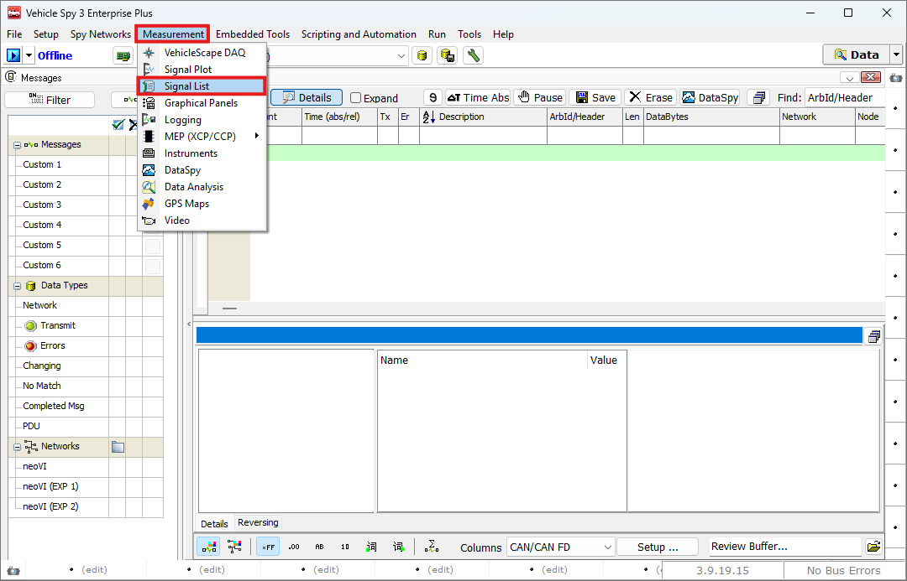
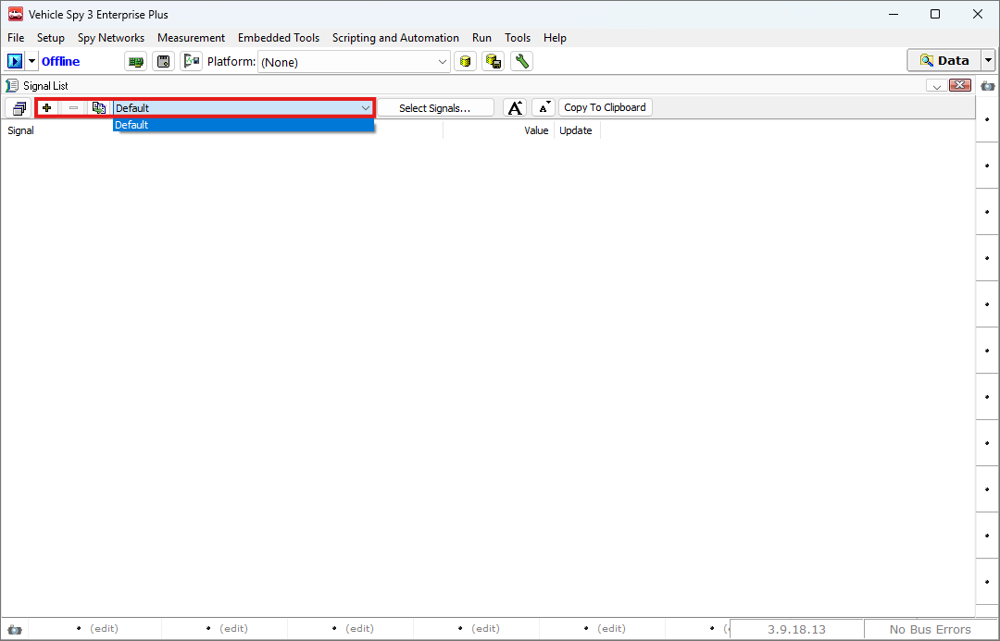
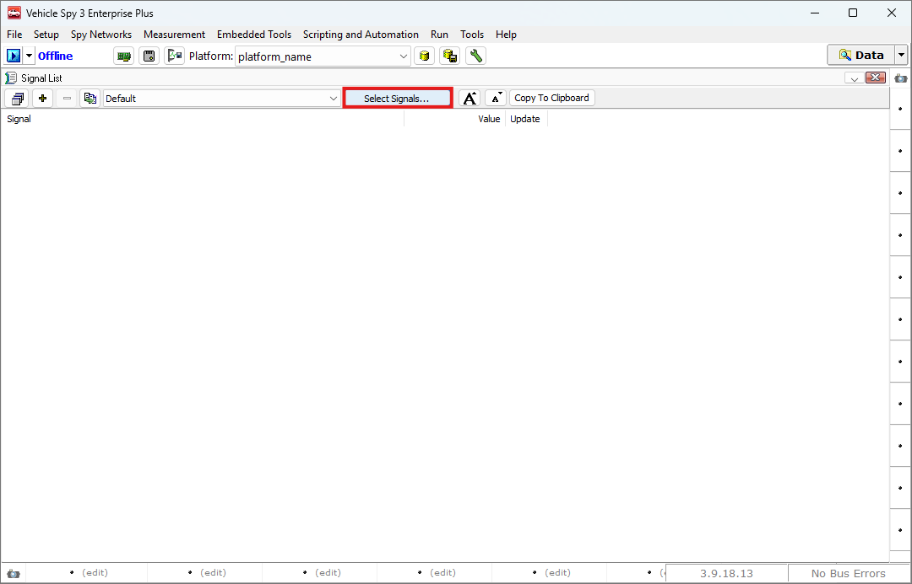
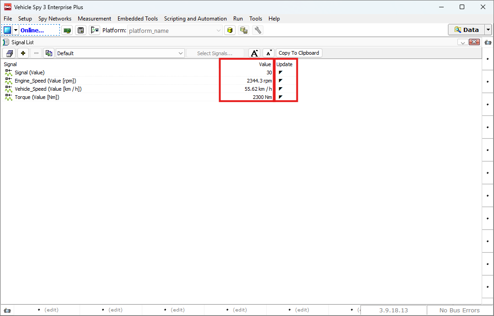

# 실시간 신호 값 보기

### 들어가며..

이번 챕터에서는 실시간으로 업데이트되는 신호값들을 한 화면에서 볼 수 있는 방법에 대해 소개합니다.

### Signal List

아래 그림과 같이 Measurement > Signal List로 이동합니다.

<figure>

<figcaption>Measurement > Signal List</figcaption>
</figure>

Signal List 창은 아래 그림과 같습니다.

<figure>

<figcaption>Signal List: Basic Layout</figcaption>
</figure>

Vehicle Spy 3에서는 Signal들을 보다 효율적으로 관리하기 위해 Signal Group이라는 단위로 신호를 그룹화합니다.

하단의 + 버튼을 사용하여 새로운 Signal Group을 생성할 수 있으며, - 버튼을 통해 기존 그룹을 삭제할 수 있습니다. 또한, 우측의 Default 드롭다운을 통해 현재 선택되어있는 Signal Group을 확인하고 변경할 수 있습니다.

:::info[info]

한 번 생성한 Signal Group은 다음 페이지에서 설명할 Signal Plot에서도 그대로 사용할 수 있습니다.

:::

### Select Signals

아래 그림과 같이 Select Signals... 버튼을 클릭하여 화면에 표시할 시그널을 선택 할 수 있습니다.

<figure>

<figcaption>Signal List: Select Signals...</figcaption>
</figure>

Select Signals... 버튼을 누르면 아래 그림과 같이 Enter Signals 탭이 열립니다.

<figure>

")
<figcaption>Signal List: Enter Signals (1)</figcaption>
</figure>

<figure>

")
<figcaption>Signal List: Enter Signals (2)</figcaption>
</figure>

아래와 같은 절차를 통해 원하는 시그널을 선택할 수 있습니다.

1. 좌측의 탭에서 시그널이 들어있는 네트워크를 선택합니다.
2. 중앙의 탭에서 모니터링을 원하는 시그널을 더블클릭하여 선택합니다. 이 때 하단의 Properties 탭을 통해 해당 시그널의 특정 값 또는 상태를 모니터링 하실 수 있습니다.
3. 선택된 시그널은 좌측 상단의 - 버튼을 통해 선택된 시그널을 제거하거나, 우측의 화살표 버튼을 통해 시그널의 표시 순서를 조절할 수 있습니다.

원하는 시그널을 모두 선택하였다면 우측 상단의 OK 버튼을 통해 다시 Signal List 창으로 나옵니다.

### 업데이트 시그널 확인

신호들이 정상적으로 업데이트 되는지 확인하려면, 좌측 상단의 버튼을 클릭하여 Online 상태로 전환해줍니다.

<figure>

<figcaption>Signal List: Show Signals</figcaption>
</figure>

Values 열을 통해 시그널들의 현재 값을 확인할 수 있습니다. 또한 우측의 Update 열을 통해 해당 시그널의 수신 여부를 확인할 수 있습니다.

<!-- :::info[info]

imh 와 img 버튼을 이용하여 화면에 표시되는 글자 크기를 조정할 수 있습니다.

::: -->